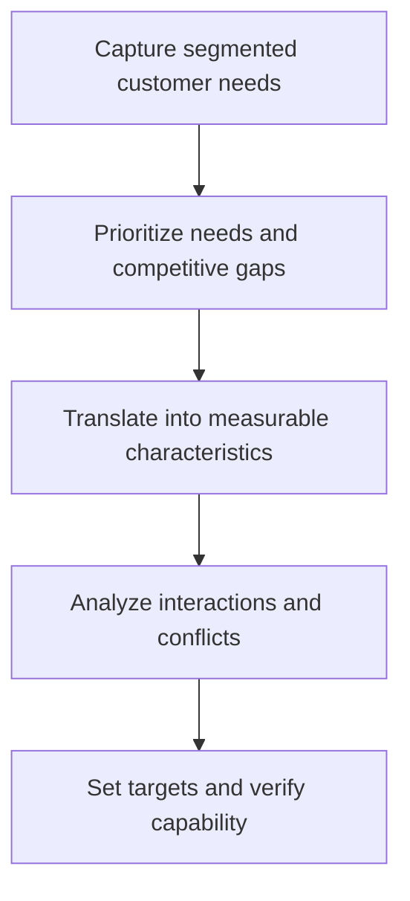

# 7. Quality, Customer Translation, and Robust Design

## Learning objectives

After this topic, you should be able to:

- distinguish design quality from conformance;
- translate customer needs into technical measures;
- manage conflicting characteristics;

## Concept in plain English

Design quality chooses the characteristics customers need; conformance quality delivers the approved design consistently. Structured customer translation links customer language to measurable engineering and operating requirements.

## Why it matters

A defect-free product can still disappoint if the design solves the wrong problem. Conversely, a valuable design fails when production cannot reproduce it.

## How it works

1. **Capture segmented customer needs.** Confirm the decision boundary, inputs, and accountable owner before analysis begins.
2. **Prioritize needs and competitive gaps.** Use comparable evidence and keep assumptions visible as the decision develops.
3. **Translate into measurable characteristics.** Use comparable evidence and keep assumptions visible as the decision develops.
4. **Analyze interactions and conflicts.** Use comparable evidence and keep assumptions visible as the decision develops.
5. **Set targets and verify capability.** Record the result, evidence, residual risk, and next review trigger.

## Realistic example — Rivermark Climate Systems

Customers say the rooftop unit must be 'quiet and easy to service.' Rivermark translates this into sound-power limits, panel-removal time, tool count, filter-access clearance, and diagnostic-code accuracy.

All names and values in this example are fictional and independently selected for learning purposes.

## Decision logic

- Keep the customer need visible beside each technical target.
- Separate target importance from technical difficulty.
- Verify that production and suppliers can hold critical characteristics.

## Trade-offs

| Choice tension | Decision implication |
|---|---|
| Higher targets can increase cost or reduce another characteristic | Quantify the benefit and the exposure using the same scope and horizon. |
| Extensive matrices improve traceability but require disciplined maintenance | Set a guardrail, owner, and review trigger instead of assuming one permanent answer. |

## Commonly confused with

Voice of the customer is evidence about needs. The translation method converts that evidence into design and process requirements.

## Common mistakes

- Treating the loudest customer as the whole market.
- Writing subjective needs without measurable tests.
- Ignoring negative interactions among targets.

## Original knowledge check

**Question.** Which statement is a technical requirement rather than a customer need?

A. Easy to service

B. Quiet during operation

C. Filter replacement in under eight minutes using one standard tool

D. Reliable

Answer and rationale

### Correct answer

**C. Filter replacement in under eight minutes using one standard tool**

### Why it is correct

It is measurable and testable while preserving the intent of service ease.

### Why the other answers are wrong

A, B, and D express needs but require translation.

## Practitioner perspective

Trace every critical specification back to a customer, regulatory, safety, or lifecycle need; delete orphan requirements.

## Related concepts

- [Module 3 overview](../README.md)
- [Section C overview](./README.md)
- [Sourcing and procurement formula sheet](../../calculations/sourcing-procurement/formula-sheet.md)

---

[Previous: Simplification, DFMA, and Serviceability](./06-simplification-dfma-and-serviceability.md) · [Next: Postponement, Mass Customization, and Localization](./08-postponement-mass-customization-and-localization.md)
