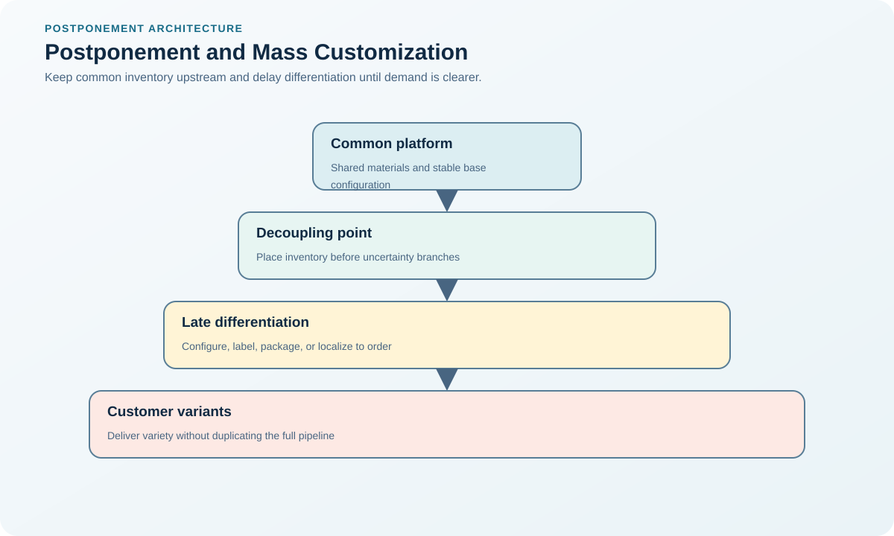

# 8. Postponement, Mass Customization, and Localization

## Learning objectives

After this topic, you should be able to:

- identify the differentiation point;
- pool uncertainty with common inventory;
- separate global platforms from local requirements;

## Concept in plain English

Postponement delays irreversible product differentiation until demand is clearer. Mass customization combines common processes and modules with controlled variety. Localization adapts a global platform to local laws, infrastructure, language, and preferences.

## Why it matters

Forecasts are usually more accurate at an aggregate level than for each finished variant. Holding common forms can reduce wrong-variant inventory while still serving diverse markets.

## Decision workflow

### Evidence retained at each stage

| Stage | Required evidence or output |
|---|---|
| **1. Map variants and demand uncertainty** | Variant, demand-uncertainty, lead-time, and forecast-accuracy map by market and option |
| **2. Find the latest feasible differentiation point** | Latest feasible differentiation point tested against customer response and process constraints |
| **3. Design common modules and local options** | Common platform plus controlled modules, labels, software, packaging, and local content |
| **4. Place skills, data, and capacity at the point** | Downstream capacity, skills, data, material, equipment, and quality-control design |
| **5. Control configuration and quality** | Configuration rules, genealogy, test coverage, release authority, and exception handling |

## Realistic example — Rivermark Climate Systems

Rivermark builds a common indoor unit and adds regional power cables, labels, firmware, and accessory kits at regional centers after orders are known. Common inventory absorbs demand swings across markets.

**Decision insight.** Common inventory pools uncertainty across markets, while regional configuration occurs only after demand is known and remains traceable to the final unit.

All names and values in this example are fictional and independently selected for learning purposes.

## Decision logic

- Delay only differentiation that can be completed reliably near demand.
- Compare pooling benefit with local labor, equipment, and compliance.
- Use configuration rules to prevent invalid combinations.

## Trade-offs

| Choice tension | Decision implication |
|---|---|
| Postponement reduces finished-goods risk but moves work downstream | Postpone only work that downstream nodes can execute repeatedly within promised lead time and total-cost limits. |
| Localization improves market fit but can erode platform scale | Localize customer- or regulatory-specific content while retaining common interfaces, master-data governance, and qualification standards. |

## Commonly confused with

Postponement delays differentiation. Delayed delivery merely waits longer and creates no pooling advantage.

## Common mistakes

- Moving work downstream without training or test capability.
- Postponing high-risk operations that require factory controls.
- Allowing local variants to bypass platform governance.

## Original knowledge check

**Question.** What creates the inventory benefit of postponement?

A. Longer supplier lead time

B. Keeping inventory in a common form until variant demand is clearer

C. Producing every variant earlier

D. Using more unique components

Answer and rationale

### Correct answer

**B. Keeping inventory in a common form until variant demand is clearer**

### Why it is correct

Common inventory pools uncertainty and reduces wrong-mix exposure.

### Why the other answers are wrong

A worsens response; C and D fragment inventory.

## Practitioner perspective

Locate the differentiation point where demand information improves faster than operating complexity increases.

## Related concepts

- [Module 3 overview](../README.md)
- [Section C overview](./README.md)
- [Sourcing and procurement formula sheet](../../calculations/sourcing-procurement/formula-sheet.md)

---

[Previous: Quality, Customer Translation, and Robust Design](./07-quality-qfd-and-robust-design.md) · [Next: Circular and Sustainable Design](./09-circular-and-sustainable-design.md)
