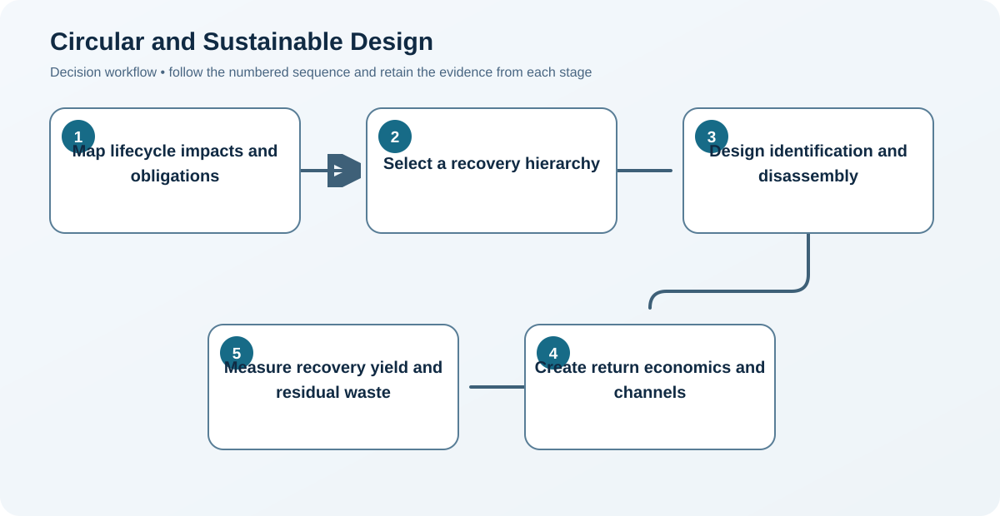

# 9. Circular and Sustainable Design

## Learning objectives

After this topic, you should be able to:

- include environmental and human impacts in design;
- design reverse flows and recovery paths;
- evaluate reuse, repair, remanufacture, and recycling;

## Concept in plain English

Sustainable design considers materials, energy, safety, durability, repair, packaging, reverse logistics, recovery, and end-of-life consequences. Circular design preserves product, component, and material value through repeated use cycles.

## Why it matters

Recovery is rarely economical when disassembly, identification, testing, ownership, and return incentives are added after launch.

## Decision model and workflow

### Evidence retained through the workflow

| Stage | Required evidence or output |
|---|---|
| **1. Map lifecycle impacts and obligations** | Lifecycle impact, material, energy, emissions, regulatory, labor, and waste baseline |
| **2. Select a recovery hierarchy** | Preferred hierarchy emphasizing prevention, life extension, reuse, repair, remanufacture, then recycling |
| **3. Design identification and disassembly** | Identification, diagnostic, disassembly, cleaning, repair, and material-separation features |
| **4. Create return economics and channels** | Return channel and economic model covering incentive, transport, inspection, yield, demand, and ownership |
| **5. Measure recovery yield and residual waste** | Recovery dashboard for return rate, reuse yield, recovered value, energy, emissions, and residual waste |

## Realistic example — Rivermark Climate Systems

Rivermark designs compressor cores with serial traceability, replaceable wear parts, standardized test ports, and a refundable core charge. Returned units are screened for reuse, remanufacture, parts harvesting, or recycling.

**Decision insight.** Traceability and standardized tests allow each return to follow the highest-value safe recovery path instead of defaulting all units to recycling.

All names and values in this example are fictional and independently selected for learning purposes.

## Decision logic

- Prefer prevention and reuse before lower-value recovery where feasible.
- Make hazardous-material and worker-safety controls explicit.
- Validate the business model for collection, inspection, and disposition.

## Trade-offs

| Choice tension | Decision implication |
|---|---|
| Durability may add material and upfront cost | Evaluate added material against longer life, repairability, failure reduction, recovery value, and avoided replacement—not purchase cost alone. |
| Easy disassembly can conflict with sealing or tamper resistance | Use selective access, reversible joints, tamper evidence, and controlled service procedures to balance recovery with safety and sealing. |

## Commonly confused with

Reverse logistics moves returned material. Circular design determines whether that returned material can retain useful value.

## Common mistakes

- Claiming recyclability without an accessible recovery channel.
- Ignoring contamination and inspection yield.
- Counting collected units as remanufactured output.

## Original knowledge check

**Question.** Which design choice most directly supports remanufacture?

A. Permanent bonding of all components

B. Unique undocumented fasteners

C. Traceable components with non-destructive disassembly and test access

D. Mixed materials that cannot be separated

Answer and rationale

### Correct answer

**C. Traceable components with non-destructive disassembly and test access**

### Why it is correct

Identification, disassembly, and verification allow valuable components to enter another controlled lifecycle.

### Why the other answers are wrong

A, B, and D make recovery more difficult or uncertain.

## Practitioner perspective

A circular claim needs a physical flow, commercial incentive, acceptance criteria, and measured yield—not only recyclable material.

## Related concepts

- [Module 3 overview](../README.md)
- [Section C overview](./README.md)
- [Sourcing and procurement formula sheet](../../calculations/sourcing-procurement/formula-sheet.md)

---

[Previous: Postponement, Mass Customization, and Localization](./08-postponement-mass-customization-and-localization.md) · [Section review](./10-section-c-review.md)
