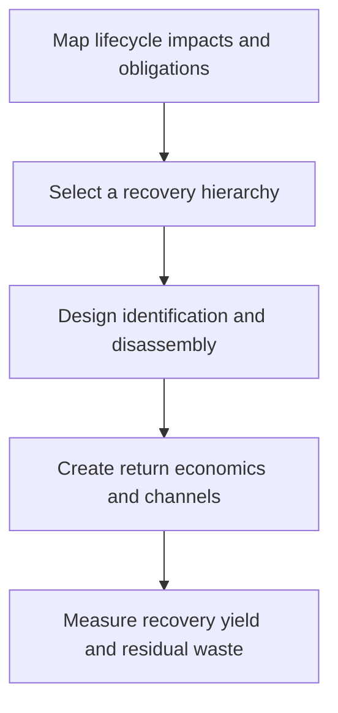

# 9. Circular and Sustainable Design

## Learning objectives

After this topic, you should be able to:

- include environmental and human impacts in design;
- design reverse flows and recovery paths;
- evaluate reuse, repair, remanufacture, and recycling;

## Concept in plain English

Sustainable design considers materials, energy, safety, durability, repair, packaging, reverse logistics, recovery, and end-of-life consequences. Circular design preserves product, component, and material value through repeated use cycles.

## Why it matters

Recovery is rarely economical when disassembly, identification, testing, ownership, and return incentives are added after launch.

## How it works

1. **Map lifecycle impacts and obligations.** Confirm the decision boundary, inputs, and accountable owner before analysis begins.
2. **Select a recovery hierarchy.** Use comparable evidence and keep assumptions visible as the decision develops.
3. **Design identification and disassembly.** Use comparable evidence and keep assumptions visible as the decision develops.
4. **Create return economics and channels.** Use comparable evidence and keep assumptions visible as the decision develops.
5. **Measure recovery yield and residual waste.** Record the result, evidence, residual risk, and next review trigger.

## Realistic example — Rivermark Climate Systems

Rivermark designs compressor cores with serial traceability, replaceable wear parts, standardized test ports, and a refundable core charge. Returned units are screened for reuse, remanufacture, parts harvesting, or recycling.

All names and values in this example are fictional and independently selected for learning purposes.

## Decision logic

- Prefer prevention and reuse before lower-value recovery where feasible.
- Make hazardous-material and worker-safety controls explicit.
- Validate the business model for collection, inspection, and disposition.

## Trade-offs

| Choice tension | Decision implication |
|---|---|
| Durability may add material and upfront cost | Quantify the benefit and the exposure using the same scope and horizon. |
| Easy disassembly can conflict with sealing or tamper resistance | Set a guardrail, owner, and review trigger instead of assuming one permanent answer. |

## Commonly confused with

Reverse logistics moves returned material. Circular design determines whether that returned material can retain useful value.

## Common mistakes

- Claiming recyclability without an accessible recovery channel.
- Ignoring contamination and inspection yield.
- Counting collected units as remanufactured output.

## Original knowledge check

**Question.** Which design choice most directly supports remanufacture?

A. Permanent bonding of all components

B. Unique undocumented fasteners

C. Traceable components with non-destructive disassembly and test access

D. Mixed materials that cannot be separated

Answer and rationale

### Correct answer

**C. Traceable components with non-destructive disassembly and test access**

### Why it is correct

Identification, disassembly, and verification allow valuable components to enter another controlled lifecycle.

### Why the other answers are wrong

A, B, and D make recovery more difficult or uncertain.

## Practitioner perspective

A circular claim needs a physical flow, commercial incentive, acceptance criteria, and measured yield—not only recyclable material.

## Related concepts

- [Module 3 overview](../README.md)
- [Section C overview](./README.md)
- [Sourcing and procurement formula sheet](../../calculations/sourcing-procurement/formula-sheet.md)

---

[Previous: Postponement, Mass Customization, and Localization](./08-postponement-mass-customization-and-localization.md) · [Section review](./10-section-c-review.md)
