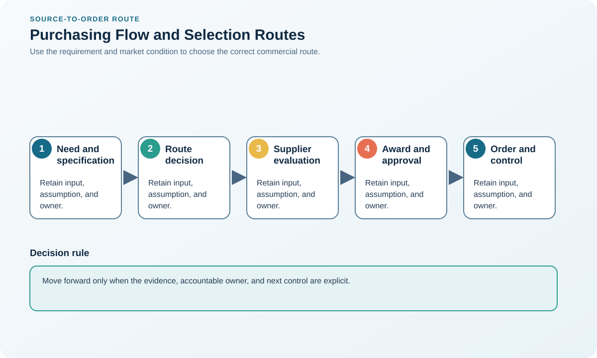

# 1. Purchasing Flow and Supplier-Selection Routes

## Learning objectives

After this topic, you should be able to:

- trace purchasing from need to improvement;
- choose an appropriate supplier-search route;
- maintain separation of duties;

## Concept in plain English

The purchasing flow converts an approved external requirement into supplier evaluation, negotiation, award, order, receipt, settlement, performance review, and improvement. Selection routes include qualified lists, requests for information, quotations, proposals, tenders, and direct negotiation.

## Why it matters

A clear flow prevents unauthorized commitments, incomparable bids, conflicts of interest, and awards that cannot be operationalized.

## Decision model and workflow

### Evidence retained through the workflow

| Stage | Required evidence or output |
|---|---|
| **1. Approve the requirement and route** | Approved business need, budget, specification maturity, risk level, and sourcing route |
| **2. Identify and prequalify candidates** | Longlist and prequalification evidence for legal, technical, quality, capacity, security, and financial fitness |
| **3. Issue a consistent request** | Consistent request package with instructions, timetable, assumptions, data, and evaluation method |
| **4. Evaluate evidence and risk** | Cross-functional evaluation record covering gates, weighted value, risk, references, and site evidence |
| **5. Negotiate, award, onboard, and measure** | Negotiated award, approvals, onboarding plan, master data, controls, and performance baseline |

## Realistic example — Rivermark Climate Systems

Rivermark uses a proposal process for compressor assemblies because design support and capacity planning matter. It uses a quotation process for standard fasteners after suppliers pass quality and cybersecurity requirements.

**Decision insight.** The route differs because compressors require solution capability and collaboration evidence, while qualified standard fasteners can be compared consistently by quotation.

All names and values in this example are fictional and independently selected for learning purposes.

## Decision logic

- Match competition method to complexity and market availability.
- Separate mandatory qualification from weighted value scoring.
- Record conflicts, approvals, and the award rationale.

## Trade-offs

| Choice tension | Decision implication |
|---|---|
| Broad competition improves discovery but increases evaluation effort | Broaden discovery for unfamiliar markets, then prequalify before demanding expensive proposals or exposing sensitive information. |
| Direct negotiation is efficient with a unique source but weakens price discovery | Use direct negotiation only with documented source justification, cost evidence, approval, and periodic market testing. |

## Commonly confused with

An RFI explores capability and the market. An RFQ requests price for a well-defined requirement. An RFP seeks a proposed solution to a broader problem.

## Common mistakes

- Requesting bids before specifications and criteria are stable.
- Changing criteria after offers arrive.
- Letting price scoring override mandatory risk failures.

## Original knowledge check

**Question.** Which route best fits a complex outcome with several possible solutions?

A. Simple catalog order

B. Request for proposal

C. Uncontrolled email quote

D. Automatic reverse auction

Answer and rationale

### Correct answer

**B. Request for proposal**

### Why it is correct

A proposal process lets suppliers explain solution, capability, implementation, risk, and commercial structure.

### Why the other answers are wrong

A, C, and D assume a more standardized and price-comparable requirement.

## Practitioner perspective

Write the evaluation model before the request goes out. That is the best defense against hindsight bias.

## Related concepts

- [Module 3 overview](../README.md)
- [Section D overview](./README.md)
- [Sourcing and procurement formula sheet](../../calculations/sourcing-procurement/formula-sheet.md)

---

[Section overview](./README.md) · [Next: Supplier Criteria and Weighted Evaluation](./02-supplier-criteria-and-scorecards.md)
