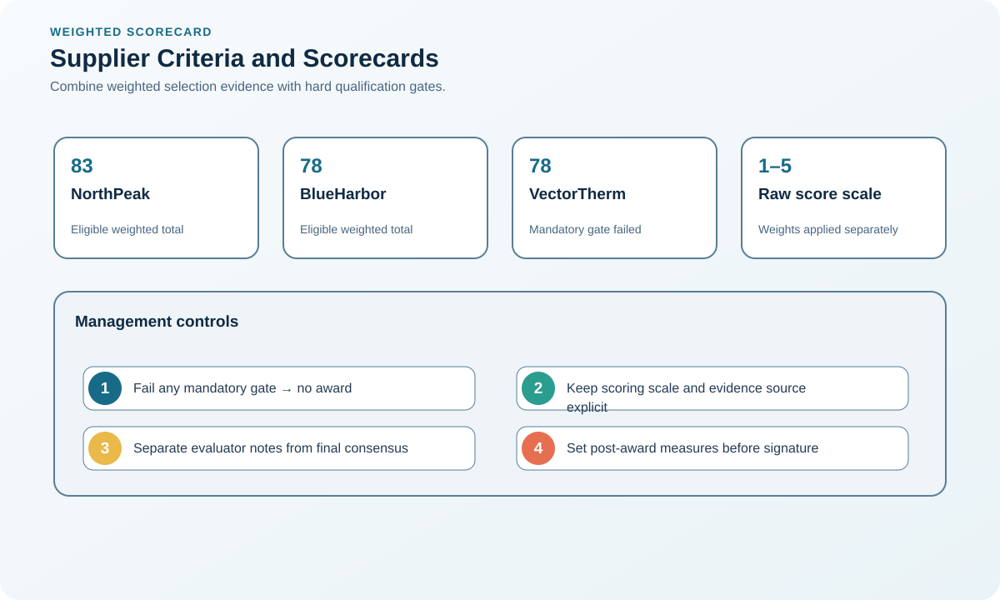
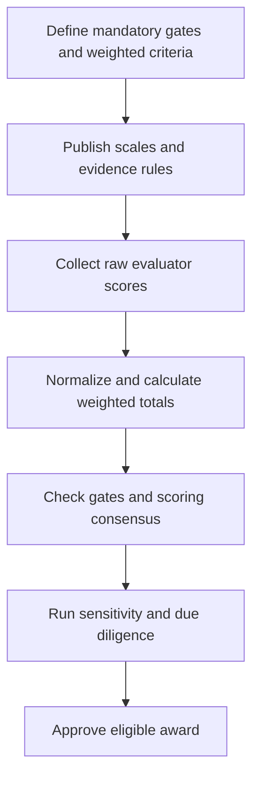

# 2. Supplier Criteria and Weighted Evaluation

## Learning objectives

After this topic, you should be able to:

- create evidence-based criteria;
- distinguish gates from weighted factors;
- test score sensitivity;

## Concept in plain English

Supplier evaluation combines mandatory gates with weighted criteria such as total cost, technical capability, quality, delivery, capacity, resilience, sustainability, cybersecurity, innovation, service, and financial health.

## Why it matters

A numerical score is useful only when criteria are defined, evidence is comparable, and weighting reflects the category strategy.

## Decision model and workflow

### Evidence retained through the workflow

| Stage | Required evidence or output |
|---|---|
| **1. Define pass/fail gates** | Non-negotiable gates linked to safety, law, quality, security, capacity, or business continuity |
| **2. Define weighted criteria and scales** | Weighted criteria, subcriteria, definitions, evidence rules, and anchored scoring scale |
| **3. Collect comparable evidence** | Comparable supplier responses normalized for scope, volume, location, currency, and timing |
| **4. Score cross-functionally** | Cross-functional scoring with comments, conflicts, confidence, and governance against bias |
| **5. Test sensitivity and document judgment** | Sensitivity analysis and final judgment showing whether reasonable weight changes alter rank |

## Practical process flow

## Realistic example — Rivermark Climate Systems

Rivermark gives compressor candidates 25% technical, 20% total cost, 15% quality, 15% capacity and delivery, 15% resilience, and 10% sustainability. A cybersecurity control is a mandatory gate rather than points that a low price can offset.

**Decision insight.** Cybersecurity remains non-compensable, while the weighted model makes the economic and operational trade-offs among qualified suppliers transparent.

All names and values in this example are fictional and independently selected for learning purposes.

## Worked decision — transparent weighted evaluation

The [supplier-evaluation dataset](../../assets/data/module-3/section-d/supplier-evaluation.csv) stores raw scores on a 1–5 scale and embeds each criterion weight in the column name. Calculate:

`weighted total = Σ(raw score ÷ 5 × criterion weight)`

NorthPeak earns `(4.40/5×25) + (3.75/5×20) + (4.67/5×15) + (4.33/5×15) + (3.67/5×15) + (4.00/5×10) ≈ 83`. BlueHarbor scores 78. VectorTherm also scores 78 but fails a mandatory gate and is therefore ineligible until the failure is resolved and reapproved.

Test whether plausible weight changes reverse the ranking, preserve evaluator evidence and comments, and complete due diligence before award. The score supports judgment; it does not replace gates or approval.

## Decision logic

- Describe what each score means before evaluation.
- Use site evidence and data where consequences are high.
- Re-run the ranking under plausible weights and assumptions.

## Trade-offs

| Choice tension | Decision implication |
|---|---|
| Weights make priorities explicit but can create false precision | Use weights to expose priorities, then test rank stability and require narrative judgment for close or low-confidence results. |
| Gates protect critical needs but reduce the candidate pool | Limit gates to true disqualifiers and create a time-bound remediation path only when the underlying risk can be controlled. |

## Commonly confused with

A qualification gate determines eligibility. A weighted factor distinguishes among eligible alternatives.

## Common mistakes

- Scoring vague labels such as 'good service'.
- Averaging away a critical failure.
- Using supplier presentations as the only evidence.

## Original knowledge check

**Question.** How should a legally required product certification be evaluated?

A. As a low-weight preference

B. As a mandatory qualification gate

C. As a weighted criterion whose points can offset noncompliance

D. As a post-award measure without pre-award qualification evidence

Answer and rationale

### Correct answer

**B. As a mandatory qualification gate**

### Why it is correct

A supplier that cannot meet a binding requirement is not a feasible alternative.

### Why the other answers are wrong

A and C allow weighted points to compensate for infeasibility; D postpones required evidence until after the decision.

## Practitioner perspective

Keep the raw evidence next to the score. Reviewers should be able to reproduce the conclusion.

## Related concepts

- [Module 3 overview](../README.md)
- [Section overview](./README.md)
- [Supplier-evaluation dataset](../../assets/data/module-3/section-d/supplier-evaluation.csv)
- [Purchasing Flow and Selection Routes](./01-purchasing-flow-and-selection-routes.md)
- [Sourcing and procurement formula sheet](../../calculations/sourcing-procurement/formula-sheet.md)

---

[Previous: Purchasing Flow and Supplier-Selection Routes](./01-purchasing-flow-and-selection-routes.md) · [Next: Competitive Bidding and Direct Negotiation](./03-competitive-bidding-and-direct-negotiation.md)
