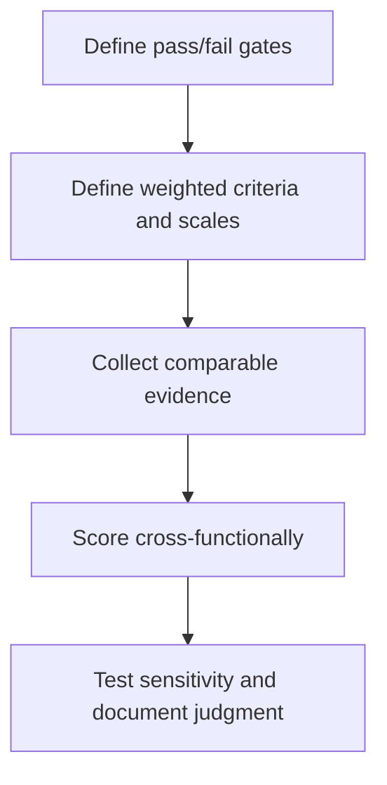

# 2. Supplier Criteria and Weighted Evaluation

## Learning objectives

After this topic, you should be able to:

- create evidence-based criteria;
- distinguish gates from weighted factors;
- test score sensitivity;

## Concept in plain English

Supplier evaluation combines mandatory gates with weighted criteria such as total cost, technical capability, quality, delivery, capacity, resilience, sustainability, cybersecurity, innovation, service, and financial health.

## Why it matters

A numerical score is useful only when criteria are defined, evidence is comparable, and weighting reflects the category strategy.

## How it works

1. **Define pass/fail gates.** Confirm the decision boundary, inputs, and accountable owner before analysis begins.
2. **Define weighted criteria and scales.** Use comparable evidence and keep assumptions visible as the decision develops.
3. **Collect comparable evidence.** Use comparable evidence and keep assumptions visible as the decision develops.
4. **Score cross-functionally.** Use comparable evidence and keep assumptions visible as the decision develops.
5. **Test sensitivity and document judgment.** Record the result, evidence, residual risk, and next review trigger.

## Realistic example — Rivermark Climate Systems

Rivermark gives compressor candidates 25% technical, 20% total cost, 15% quality, 15% capacity and delivery, 15% resilience, and 10% sustainability. A cybersecurity control is a mandatory gate rather than points that a low price can offset.

All names and values in this example are fictional and independently selected for learning purposes.

## Decision logic

- Describe what each score means before evaluation.
- Use site evidence and data where consequences are high.
- Re-run the ranking under plausible weights and assumptions.

## Trade-offs

| Choice tension | Decision implication |
|---|---|
| Weights make priorities explicit but can create false precision | Quantify the benefit and the exposure using the same scope and horizon. |
| Gates protect critical needs but reduce the candidate pool | Set a guardrail, owner, and review trigger instead of assuming one permanent answer. |

## Commonly confused with

A qualification gate determines eligibility. A weighted factor distinguishes among eligible alternatives.

## Common mistakes

- Scoring vague labels such as 'good service'.
- Averaging away a critical failure.
- Using supplier presentations as the only evidence.

## Original knowledge check

**Question.** How should a legally required product certification be evaluated?

A. As a low-weight preference

B. As a mandatory qualification gate

C. Only after award

D. As a price adjustment

Answer and rationale

### Correct answer

**B. As a mandatory qualification gate**

### Why it is correct

A supplier that cannot meet a binding requirement is not a feasible alternative.

### Why the other answers are wrong

A and D allow compensation for noncompliance; C delays the essential test.

## Practitioner perspective

Keep the raw evidence next to the score. Reviewers should be able to reproduce the conclusion.

## Related concepts

- [Module 3 overview](../README.md)
- [Section D overview](./README.md)
- [Sourcing and procurement formula sheet](../../calculations/sourcing-procurement/formula-sheet.md)

---

[Previous: Purchasing Flow and Supplier-Selection Routes](./01-purchasing-flow-and-selection-routes.md) · [Next: Competitive Bidding and Direct Negotiation](./03-competitive-bidding-and-direct-negotiation.md)
