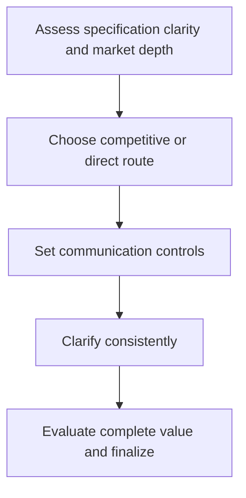

# 3. Competitive Bidding and Direct Negotiation

## Learning objectives

After this topic, you should be able to:

- select between competition and negotiation;
- protect comparability;
- recognize when price-only events are inappropriate;

## Concept in plain English

Competitive bidding works when the requirement is clear, suppliers are genuinely comparable, and switching is feasible. Direct negotiation is often more suitable for unique capability, complex risk, strategic collaboration, or scarce supply.

## Why it matters

Forcing a strategic or poorly specified requirement into a price event can select the wrong solution and damage future collaboration.

## How it works

1. **Assess specification clarity and market depth.** Confirm the decision boundary, inputs, and accountable owner before analysis begins.
2. **Choose competitive or direct route.** Use comparable evidence and keep assumptions visible as the decision develops.
3. **Set communication controls.** Use comparable evidence and keep assumptions visible as the decision develops.
4. **Clarify consistently.** Use comparable evidence and keep assumptions visible as the decision develops.
5. **Evaluate complete value and finalize.** Record the result, evidence, residual risk, and next review trigger.

## Realistic example — Rivermark Climate Systems

Rivermark competitively bids standard sheet metal using a normalized cost template. It directly negotiates a compressor collaboration because interface development, tooling, forecast sharing, and service support require joint design.

All names and values in this example are fictional and independently selected for learning purposes.

## Decision logic

- Use the same clarification information for all active bidders.
- Do not manufacture competition when only one source is feasible.
- Evaluate total value and risk, not headline price.

## Trade-offs

| Choice tension | Decision implication |
|---|---|
| Bidding improves market discovery but can encourage gaming | Quantify the benefit and the exposure using the same scope and horizon. |
| Direct negotiation supports problem solving but needs a strong fact base | Set a guardrail, owner, and review trigger instead of assuming one permanent answer. |

## Commonly confused with

Direct negotiation is not sole sourcing by definition; several candidates may be narrowed and negotiated with before award.

## Common mistakes

- Inviting unqualified bidders to create leverage.
- Comparing bids with different scope.
- Running a reverse auction for differentiated quality or service.

## Original knowledge check

**Question.** When is a reverse auction least appropriate?

A. Standard commodity with qualified interchangeable suppliers

B. Excess inventory liquidation

C. A safety-critical custom assembly requiring joint engineering

D. A well-specified spot purchase

Answer and rationale

### Correct answer

**C. A safety-critical custom assembly requiring joint engineering**

### Why it is correct

Price-only competition cannot represent collaboration, technical integration, and safety risk.

### Why the other answers are wrong

A, B, and D involve more standardized, price-comparable transactions.

## Practitioner perspective

Competition is a means of discovering value, not a ritual. Use it only when the market and specification support a fair comparison.

## Related concepts

- [Module 3 overview](../README.md)
- [Section D overview](./README.md)
- [Sourcing and procurement formula sheet](../../calculations/sourcing-procurement/formula-sheet.md)

---

[Previous: Supplier Criteria and Weighted Evaluation](./02-supplier-criteria-and-scorecards.md) · [Next: Principled Negotiation and BATNA](./04-principled-negotiation-and-batna.md)
