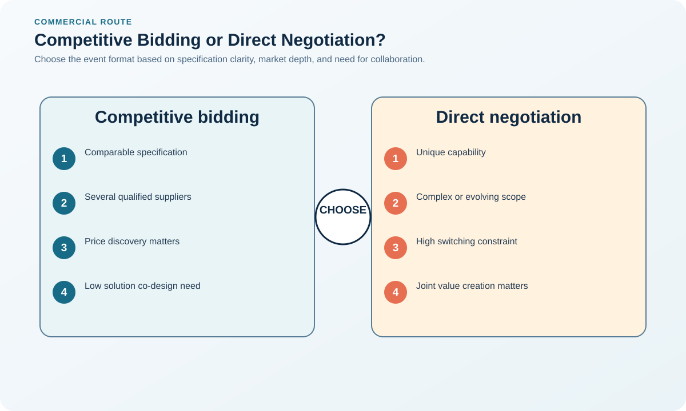
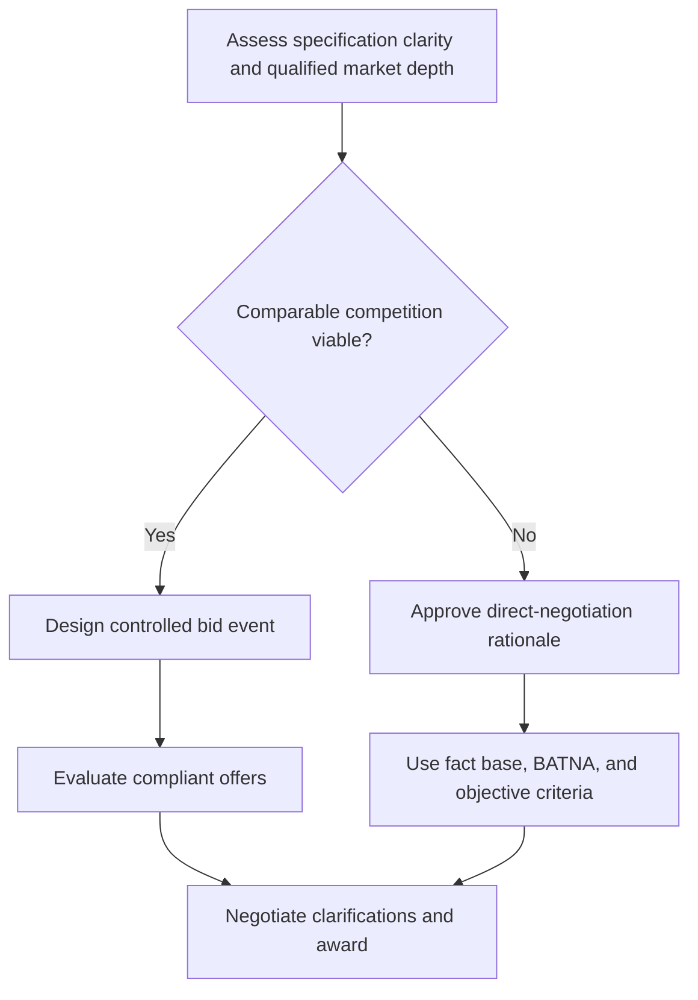

# 3. Competitive Bidding and Direct Negotiation

## Learning objectives

After this topic, you should be able to:

- select between competition and negotiation;
- protect comparability;
- recognize when price-only events are inappropriate;

## Concept in plain English

Competitive bidding works when the requirement is clear, suppliers are genuinely comparable, and switching is feasible. Direct negotiation is often more suitable for unique capability, complex risk, strategic collaboration, or scarce supply.

## Why it matters

Forcing a strategic or poorly specified requirement into a price event can select the wrong solution and damage future collaboration.

## Decision model and workflow

### Evidence retained through the workflow

| Stage | Required evidence or output |
|---|---|
| **1. Assess specification clarity and market depth** | Assessment of specification clarity, switching feasibility, market depth, and offer comparability |
| **2. Choose competitive or direct route** | Approved route with competition plan or documented single-source rationale |
| **3. Set communication controls** | Communication protocol covering contacts, confidentiality, changes, questions, and deadlines |
| **4. Clarify consistently** | Shared clarification log ensuring active bidders receive materially equivalent information |
| **5. Evaluate complete value and finalize** | Normalized total-value evaluation and complete negotiated agreement with approvals |

## Practical process flow

## Realistic example — Rivermark Climate Systems

Rivermark competitively bids standard sheet metal using a normalized cost template. It directly negotiates a compressor collaboration because interface development, tooling, forecast sharing, and service support require joint design.

**Decision insight.** Rivermark uses competition where specifications and offers are comparable, but chooses structured negotiation where joint design determines value.

All names and values in this example are fictional and independently selected for learning purposes.

## Applied decision artifact — event integrity checklist

For a competitive event, establish one specification baseline, response template, question channel, deadline, evaluation team, conflict declaration, and change log. Release material clarifications to all participants. Do not introduce an auction unless offers are truly comparable and qualified suppliers understand the rules.

For direct negotiation, record the constraint, alternatives considered, approval, fact base, objectives, BATNA, authority, and independent reasonableness check. Competition can reveal market price but may suppress collaboration when the solution is not defined; negotiation can create joint value but weakens price discovery. The decision record should make that trade-off auditable.

## Decision logic

- Use the same clarification information for all active bidders.
- Do not manufacture competition when only one source is feasible.
- Evaluate total value and risk, not headline price.

## Trade-offs

| Choice tension | Decision implication |
|---|---|
| Bidding improves market discovery but can encourage gaming | Design bids around comparable requirements and total value; reject unbalanced offers that recover a low headline price elsewhere. |
| Direct negotiation supports problem solving but needs a strong fact base | Prepare objective benchmarks, alternatives, approval limits, and fact-based cost drivers before entering a direct negotiation. |

## Commonly confused with

Direct negotiation is not sole sourcing by definition; several candidates may be narrowed and negotiated with before award.

## Common mistakes

- Inviting unqualified bidders to create leverage.
- Comparing bids with different scope.
- Running a reverse auction for differentiated quality or service.

## Original knowledge check

**Question.** When is a reverse auction least appropriate?

A. Standard commodity with qualified interchangeable suppliers

B. Excess inventory liquidation

C. A safety-critical custom assembly requiring joint engineering

D. A well-specified spot purchase

Answer and rationale

### Correct answer

**C. A safety-critical custom assembly requiring joint engineering**

### Why it is correct

Price-only competition cannot represent collaboration, technical integration, and safety risk.

### Why the other answers are wrong

A, B, and D involve more standardized, price-comparable transactions.

## Practitioner perspective

Competition is a means of discovering value, not a ritual. Use it only when the market and specification support a fair comparison.

## Related concepts

- [Module 3 overview](../README.md)
- [Section overview](./README.md)
- [Principled Negotiation and BATNA](./04-principled-negotiation-and-batna.md)
- [Digital Procurement, Marketplaces, and Auctions](./12-digital-procurement-marketplaces-and-auctions.md)

---

[Previous: Supplier Criteria and Weighted Evaluation](./02-supplier-criteria-and-scorecards.md) · [Next: Principled Negotiation and BATNA](./04-principled-negotiation-and-batna.md)
