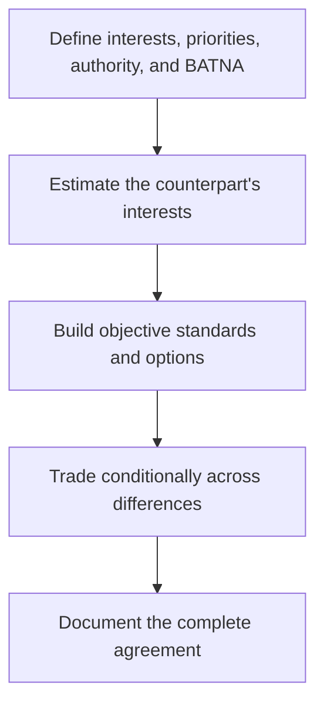

# 4. Principled Negotiation and BATNA

## Learning objectives

After this topic, you should be able to:

- prepare interests and alternatives;
- use objective criteria;
- create mutual-gain options without accepting poor terms;

## Concept in plain English

Principled negotiation separates people from the problem, focuses on interests rather than positions, develops options for mutual gain, and uses objective criteria. A BATNA is the best feasible action if agreement is not reached.

## Why it matters

Without a credible alternative, negotiators may accept an unattractive agreement or bluff beyond their ability to walk away.

## How it works

1. **Define interests, priorities, authority, and BATNA.** Confirm the decision boundary, inputs, and accountable owner before analysis begins.
2. **Estimate the counterpart's interests.** Use comparable evidence and keep assumptions visible as the decision develops.
3. **Build objective standards and options.** Use comparable evidence and keep assumptions visible as the decision develops.
4. **Trade conditionally across differences.** Use comparable evidence and keep assumptions visible as the decision develops.
5. **Document the complete agreement.** Record the result, evidence, residual risk, and next review trigger.

## Realistic example — Rivermark Climate Systems

Rivermark wants surge capacity; the supplier wants stable loading. They exchange a rolling forecast and minimum annual volume for a reserved surge band, with performance evidence and an exit trigger.

All names and values in this example are fictional and independently selected for learning purposes.

## Decision logic

- Distinguish must-have needs from preferences.
- Value concessions before offering them.
- Compare the final package with the BATNA—not with an opening position.

## Trade-offs

| Choice tension | Decision implication |
|---|---|
| More transparency can unlock value but requires trust and information boundaries | Quantify the benefit and the exposure using the same scope and horizon. |
| A strong alternative improves discipline but may cost money to maintain | Set a guardrail, owner, and review trigger instead of assuming one permanent answer. |

## Commonly confused with

BATNA is an external course of action if talks fail. A reservation point is the threshold beyond which the agreement is worse than that alternative.

## Common mistakes

- Treating the other party as the problem.
- Negotiating one issue at a time without package trades.
- Entering talks without approval limits.

## Original knowledge check

**Question.** What should determine whether a negotiator walks away?

A. Whether the supplier accepted the opening price

B. Whether the final package is worse than the best feasible alternative

C. Whether the meeting ran long

D. Whether a concession was requested

Answer and rationale

### Correct answer

**B. Whether the final package is worse than the best feasible alternative**

### Why it is correct

The BATNA provides the rational comparison for agreement value.

### Why the other answers are wrong

A, C, and D do not establish the value of the full outcome.

## Practitioner perspective

Prepare a concession ledger with cost, value to the other party, conditions, and approval authority.

## Related concepts

- [Module 3 overview](../README.md)
- [Section D overview](./README.md)
- [Sourcing and procurement formula sheet](../../calculations/sourcing-procurement/formula-sheet.md)

---

[Previous: Competitive Bidding and Direct Negotiation](./03-competitive-bidding-and-direct-negotiation.md) · [Next: Contract Deployment and Compliance](./05-contract-deployment-and-compliance.md)
