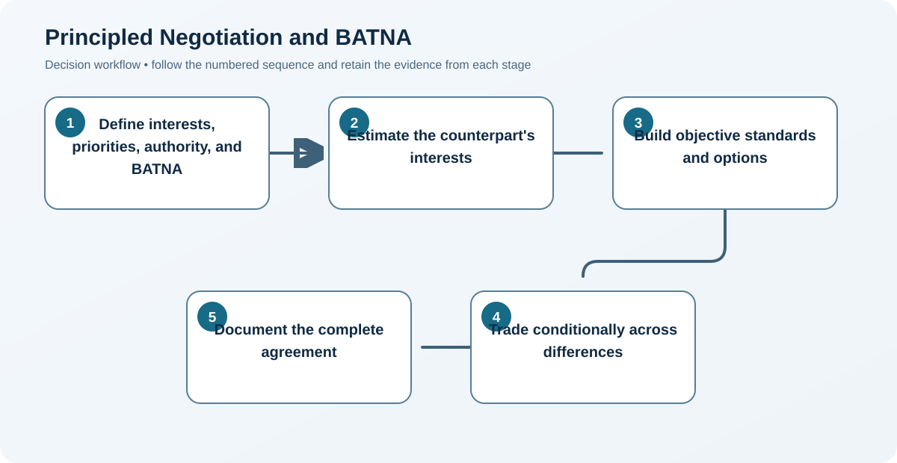
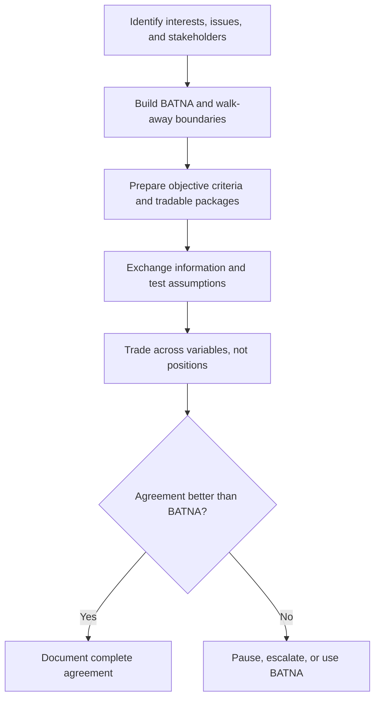

# 4. Principled Negotiation and BATNA

## Learning objectives

After this topic, you should be able to:

- prepare interests and alternatives;
- use objective criteria;
- create mutual-gain options without accepting poor terms;

## Concept in plain English

Principled negotiation separates people from the problem, focuses on interests rather than positions, develops options for mutual gain, and uses objective criteria. A BATNA is the best feasible action if agreement is not reached.

## Why it matters

Without a credible alternative, negotiators may accept an unattractive agreement or bluff beyond their ability to walk away.

## Decision model and workflow

### Evidence retained through the workflow

| Stage | Required evidence or output |
|---|---|
| **1. Define interests, priorities, authority, and BATNA** | Interests, priorities, targets, reservation points, authority, risks, and credible alternative |
| **2. Estimate the counterpart's interests** | Hypotheses about counterpart economics, constraints, stakeholders, alternatives, and priorities |
| **3. Build objective standards and options** | Objective standards plus multiple packages that create value across differing preferences |
| **4. Trade conditionally across differences** | Conditional trades written as linked exchanges rather than one-sided concessions |
| **5. Document the complete agreement** | Complete term sheet covering price, scope, performance, risk, change, governance, and closure |

## Practical process flow

## Realistic example — Rivermark Climate Systems

Rivermark wants surge capacity; the supplier wants stable loading. They exchange a rolling forecast and minimum annual volume for a reserved surge band, with performance evidence and an exit trigger.

**Decision insight.** The exchange works because stable loading is valuable to the supplier and reserved surge capacity is valuable to Rivermark; both obligations are measurable.

All names and values in this example are fictional and independently selected for learning purposes.

## Applied decision artifact — negotiation preparation sheet

Prepare each issue with target, limit, evidence, authority, and tradable variables. Include price structure, indexation, payment, volume flexibility, capacity, lead time, warranty, intellectual property, liability, implementation, and governance. Estimate the supplier’s likely interests without presenting assumptions as facts.

Build a credible BATNA with owner, timing, switching cost, and probability; a theoretical alternative is not negotiating leverage. Design packages that exchange variables with different value to each side—for example, a longer commitment for capacity reservation and transparent indexation. Before closing, compare the complete package with the BATNA and document contingent terms, definitions, and unresolved items.

## Decision logic

- Distinguish must-have needs from preferences.
- Value concessions before offering them.
- Compare the final package with the BATNA—not with an opening position.

## Trade-offs

| Choice tension | Decision implication |
|---|---|
| More transparency can unlock value but requires trust and information boundaries | Disclose interests that enable joint problem solving while protecting reservation points, sensitive economics, and unauthorized commitments. |
| A strong alternative improves discipline but may cost money to maintain | Invest in an alternative only when it is executable and its option value exceeds qualification, capacity, or switching cost. |

## Commonly confused with

BATNA is an external course of action if talks fail. A reservation point is the threshold beyond which the agreement is worse than that alternative.

## Common mistakes

- Treating the other party as the problem.
- Negotiating one issue at a time without package trades.
- Entering talks without approval limits.

## Original knowledge check

**Question.** What should determine whether a negotiator walks away?

A. Whether the supplier accepted the opening price

B. Whether the final package is worse than the best feasible alternative

C. Whether the meeting ran long

D. Whether a concession was requested

Answer and rationale

### Correct answer

**B. Whether the final package is worse than the best feasible alternative**

### Why it is correct

The BATNA provides the rational comparison for agreement value.

### Why the other answers are wrong

A, C, and D do not establish the value of the full outcome.

## Practitioner perspective

Prepare a concession ledger with cost, value to the other party, conditions, and approval authority.

## Related concepts

- [Module 3 overview](../README.md)
- [Section overview](./README.md)
- [Competitive Bidding and Direct Negotiation](./03-competitive-bidding-and-direct-negotiation.md)
- [Contract Types and Risk Allocation](./06-contract-types-and-risk-allocation.md)

---

[Previous: Competitive Bidding and Direct Negotiation](./03-competitive-bidding-and-direct-negotiation.md) · [Next: Contract Deployment and Compliance](./05-contract-deployment-and-compliance.md)
