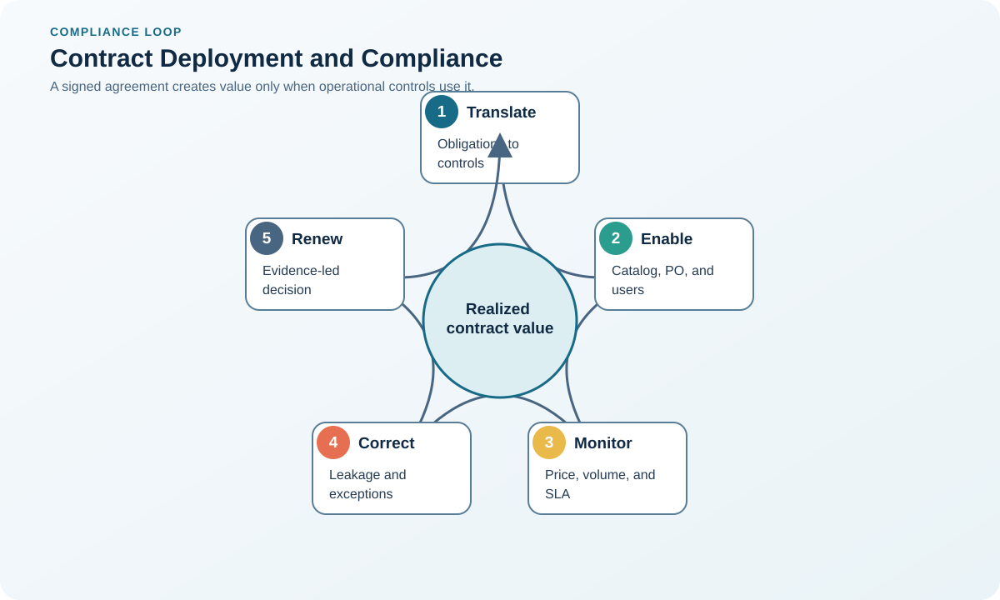

# 5. Contract Deployment and Compliance

## Learning objectives

After this topic, you should be able to:

- turn signed terms into operating controls;
- monitor internal and supplier compliance;
- capture negotiated value;

## Concept in plain English

Contract deployment loads the agreement into processes, systems, roles, catalogs, ordering rules, training, measures, and escalation paths. Compliance management checks whether both parties operate as agreed.

## Why it matters

Savings and protections remain theoretical when buyers order outside the agreement, price tables are wrong, rebates are missed, or service measures are not collected.

## Decision workflow

### Evidence retained at each stage

| Stage | Required evidence or output |
|---|---|
| **1. Translate clauses into operational obligations** | Clause-to-obligation register translating legal language into operational actions and conditions |
| **2. Assign owners, dates, data, and controls** | Named owner, due date, source data, system control, evidence, escalation, and backup |
| **3. Configure systems and train users** | Configured prices, tolerances, approvals, schedules, master data, alerts, and role-based training |
| **4. Validate early transactions** | Early-transaction checks confirming ordering, acknowledgement, receipt, invoice, rebate, and reporting behavior |
| **5. Monitor compliance, expiry, and improvement** | Compliance, leakage, expiry, renewal, claim, and improvement dashboard with actions |

## Realistic example — Rivermark Climate Systems

Rivermark maps every compressor obligation to an owner: sourcing controls price and term, planning forecast cadence, quality audit evidence, engineering change notice, logistics delivery windows, and finance rebates and payment.

**Decision insight.** The obligation map prevents negotiated value from remaining in a contract file by connecting every term to an operating owner, system, and evidence source.

All names and values in this example are fictional and independently selected for learning purposes.

## Decision logic

- Maintain one controlled obligation register.
- Test the first orders, receipts, invoices, and reports.
- Escalate internal off-contract behavior as well as supplier failure.

## Trade-offs

| Choice tension | Decision implication |
|---|---|
| Central control improves capture but requires accurate master data | Centralize obligation visibility and master-data standards while assigning operational ownership to the functions that control performance. |
| Detailed monitoring protects value but should remain proportional to risk | Monitor high-value, high-risk, and failure-prone obligations more deeply; automate routine controls where evidence is reliable. |

## Commonly confused with

Contract administration maintains records and events. Contract management actively assures performance, value, risk response, and change.

## Common mistakes

- Sending the PDF only to sourcing and legal.
- Ignoring internal adoption.
- Allowing contracts to expire without a decision calendar.

## Original knowledge check

**Question.** Which action best demonstrates successful deployment?

A. The contract is stored in a shared folder

B. Operational owners, system rules, measures, and escalation paths are active

C. The supplier sent a welcome email

D. The negotiation team closed the project

Answer and rationale

### Correct answer

**B. Operational owners, system rules, measures, and escalation paths are active**

### Why it is correct

Deployment means the agreement works through day-to-day processes and controls.

### Why the other answers are wrong

A, C, and D are administrative milestones, not operating adoption.

## Practitioner perspective

No obligation should exist only as prose. Map it to an owner, evidence source, frequency, and response.

## Related concepts

- [Module 3 overview](../README.md)
- [Section D overview](./README.md)
- [Sourcing and procurement formula sheet](../../calculations/sourcing-procurement/formula-sheet.md)

---

[Previous: Principled Negotiation and BATNA](./04-principled-negotiation-and-batna.md) · [Next: Contract Types and Risk Allocation](./06-contract-types-and-risk-allocation.md)
