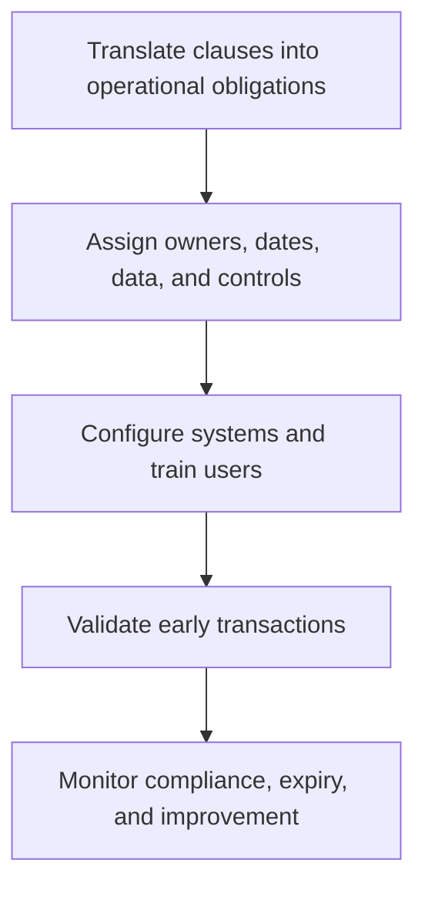

# 5. Contract Deployment and Compliance

## Learning objectives

After this topic, you should be able to:

- turn signed terms into operating controls;
- monitor internal and supplier compliance;
- capture negotiated value;

## Concept in plain English

Contract deployment loads the agreement into processes, systems, roles, catalogs, ordering rules, training, measures, and escalation paths. Compliance management checks whether both parties operate as agreed.

## Why it matters

Savings and protections remain theoretical when buyers order outside the agreement, price tables are wrong, rebates are missed, or service measures are not collected.

## How it works

1. **Translate clauses into operational obligations.** Confirm the decision boundary, inputs, and accountable owner before analysis begins.
2. **Assign owners, dates, data, and controls.** Use comparable evidence and keep assumptions visible as the decision develops.
3. **Configure systems and train users.** Use comparable evidence and keep assumptions visible as the decision develops.
4. **Validate early transactions.** Use comparable evidence and keep assumptions visible as the decision develops.
5. **Monitor compliance, expiry, and improvement.** Record the result, evidence, residual risk, and next review trigger.

## Realistic example — Rivermark Climate Systems

Rivermark maps every compressor obligation to an owner: sourcing controls price and term, planning forecast cadence, quality audit evidence, engineering change notice, logistics delivery windows, and finance rebates and payment.

All names and values in this example are fictional and independently selected for learning purposes.

## Decision logic

- Maintain one controlled obligation register.
- Test the first orders, receipts, invoices, and reports.
- Escalate internal off-contract behavior as well as supplier failure.

## Trade-offs

| Choice tension | Decision implication |
|---|---|
| Central control improves capture but requires accurate master data | Quantify the benefit and the exposure using the same scope and horizon. |
| Detailed monitoring protects value but should remain proportional to risk | Set a guardrail, owner, and review trigger instead of assuming one permanent answer. |

## Commonly confused with

Contract administration maintains records and events. Contract management actively assures performance, value, risk response, and change.

## Common mistakes

- Sending the PDF only to sourcing and legal.
- Ignoring internal adoption.
- Allowing contracts to expire without a decision calendar.

## Original knowledge check

**Question.** Which action best demonstrates successful deployment?

A. The contract is stored in a shared folder

B. Operational owners, system rules, measures, and escalation paths are active

C. The supplier sent a welcome email

D. The negotiation team closed the project

Answer and rationale

### Correct answer

**B. Operational owners, system rules, measures, and escalation paths are active**

### Why it is correct

Deployment means the agreement works through day-to-day processes and controls.

### Why the other answers are wrong

A, C, and D are administrative milestones, not operating adoption.

## Practitioner perspective

No obligation should exist only as prose. Map it to an owner, evidence source, frequency, and response.

## Related concepts

- [Module 3 overview](../README.md)
- [Section D overview](./README.md)
- [Sourcing and procurement formula sheet](../../calculations/sourcing-procurement/formula-sheet.md)

---

[Previous: Principled Negotiation and BATNA](./04-principled-negotiation-and-batna.md) · [Next: Contract Types and Risk Allocation](./06-contract-types-and-risk-allocation.md)
