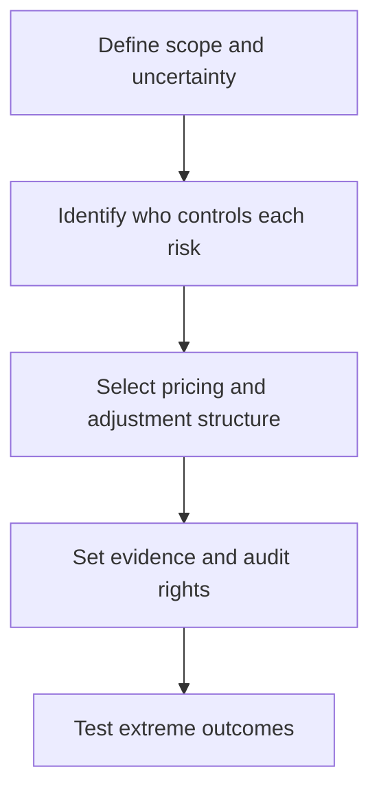

# 6. Contract Types and Risk Allocation

## Learning objectives

After this topic, you should be able to:

- compare fixed-price, cost-reimbursable, and incentive structures;
- match contract form to uncertainty;
- avoid unmanaged risk transfer;

## Concept in plain English

Contract form allocates cost and performance uncertainty. Fixed-price structures place more overrun exposure on the supplier; cost-reimbursable structures place more on the buyer; incentive structures share selected gains or losses around measurable targets.

## Why it matters

Pushing risk to a party unable to control it usually returns as price, disputes, poor quality, or supplier failure.

## How it works

1. **Define scope and uncertainty.** Confirm the decision boundary, inputs, and accountable owner before analysis begins.
2. **Identify who controls each risk.** Use comparable evidence and keep assumptions visible as the decision develops.
3. **Select pricing and adjustment structure.** Use comparable evidence and keep assumptions visible as the decision develops.
4. **Set evidence and audit rights.** Use comparable evidence and keep assumptions visible as the decision develops.
5. **Test extreme outcomes.** Record the result, evidence, residual risk, and next review trigger.

## Realistic example — Rivermark Climate Systems

Rivermark uses firm pricing for standard enclosures, indexed material adjustment for copper-intensive assemblies, and a target-cost sharing model for a jointly engineered compressor redesign.

All names and values in this example are fictional and independently selected for learning purposes.

## Decision logic

- Use fixed pricing when scope and cost are reasonably predictable.
- Use reimbursable approaches only with allowable-cost rules and oversight.
- Tie incentives to outcomes the supplier can influence.

## Trade-offs

| Choice tension | Decision implication |
|---|---|
| Fixed price creates budget certainty but includes risk premium | Quantify the benefit and the exposure using the same scope and horizon. |
| Cost reimbursement supports uncertain work but requires audit discipline | Set a guardrail, owner, and review trigger instead of assuming one permanent answer. |

## Commonly confused with

A price-adjustment clause changes price under a defined index or event; it is not permission for unilateral, unsupported increases.

## Common mistakes

- Selecting contract type only to transfer risk.
- Rewarding speed without quality and safety safeguards.
- Leaving the cost baseline ambiguous.

## Original knowledge check

**Question.** Which structure best fits well-defined, repeatable work with stable input economics?

A. Firm fixed price

B. Open-ended cost reimbursement

C. Undefined time-and-materials

D. No written agreement

Answer and rationale

### Correct answer

**A. Firm fixed price**

### Why it is correct

Predictable scope and cost make fixed pricing credible and administratively efficient.

### Why the other answers are wrong

B and C expose the buyer without need; D removes essential controls.

## Practitioner perspective

Draw a risk-allocation table beside the pricing model. If control and exposure sit with different parties, redesign the term.

## Related concepts

- [Module 3 overview](../README.md)
- [Section D overview](./README.md)
- [Sourcing and procurement formula sheet](../../calculations/sourcing-procurement/formula-sheet.md)

---

[Previous: Contract Deployment and Compliance](./05-contract-deployment-and-compliance.md) · [Next: Terms, Service Levels, and Incentives](./07-terms-slas-and-incentives.md)
