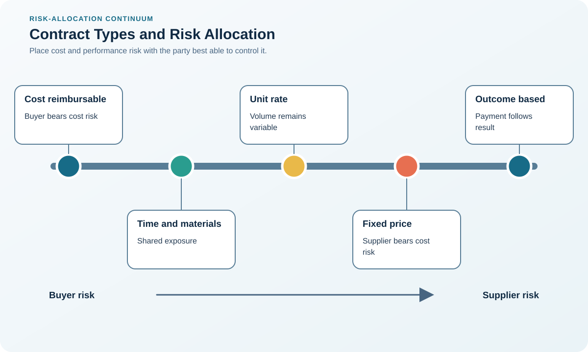

# 6. Contract Types and Risk Allocation

## Learning objectives

After this topic, you should be able to:

- compare fixed-price, cost-reimbursable, and incentive structures;
- match contract form to uncertainty;
- avoid unmanaged risk transfer;

## Concept in plain English

Contract form allocates cost and performance uncertainty. Fixed-price structures place more overrun exposure on the supplier; cost-reimbursable structures place more on the buyer; incentive structures share selected gains or losses around measurable targets.

## Why it matters

Pushing risk to a party unable to control it usually returns as price, disputes, poor quality, or supplier failure.

## Decision workflow

### Evidence retained at each stage

| Stage | Required evidence or output |
|---|---|
| **1. Define scope and uncertainty** | Scope definition, deliverables, acceptance, dependencies, duration, and uncertainty drivers |
| **2. Identify who controls each risk** | Risk register showing cause, control, owner, financial exposure, and consequence |
| **3. Select pricing and adjustment structure** | Pricing form and adjustment mechanism matched to controllability and evidence quality |
| **4. Set evidence and audit rights** | Allowable-cost, index, open-book, audit, record-retention, and approval rules |
| **5. Test extreme outcomes** | Stress test showing incentives and exposure under favorable, expected, and extreme outcomes |

## Realistic example — Rivermark Climate Systems

Rivermark uses firm pricing for standard enclosures, indexed material adjustment for copper-intensive assemblies, and a target-cost sharing model for a jointly engineered compressor redesign.

**Decision insight.** Each structure follows the underlying uncertainty: stable fabrication is fixed, observable copper exposure is indexed, and uncertain joint development shares target-cost outcomes.

All names and values in this example are fictional and independently selected for learning purposes.

## Decision logic

- Use fixed pricing when scope and cost are reasonably predictable.
- Use reimbursable approaches only with allowable-cost rules and oversight.
- Tie incentives to outcomes the supplier can influence.

## Trade-offs

| Choice tension | Decision implication |
|---|---|
| Fixed price creates budget certainty but includes risk premium | Use fixed price when the supplier can define and control delivery; otherwise price the uncertainty explicitly or narrow the scope. |
| Cost reimbursement supports uncertain work but requires audit discipline | For reimbursable work, cap exposure through budgets, ceilings, approval gates, allowable-cost rules, and audit rights. |

## Commonly confused with

A price-adjustment clause changes price under a defined index or event; it is not permission for unilateral, unsupported increases.

## Common mistakes

- Selecting contract type only to transfer risk.
- Rewarding speed without quality and safety safeguards.
- Leaving the cost baseline ambiguous.

## Original knowledge check

**Question.** Which structure best fits well-defined, repeatable work with stable input economics?

A. Firm fixed price

B. Open-ended cost reimbursement

C. Undefined time-and-materials

D. No written agreement

Answer and rationale

### Correct answer

**A. Firm fixed price**

### Why it is correct

Predictable scope and cost make fixed pricing credible and administratively efficient.

### Why the other answers are wrong

B and C expose the buyer without need; D removes essential controls.

## Practitioner perspective

Draw a risk-allocation table beside the pricing model. If control and exposure sit with different parties, redesign the term.

## Related concepts

- [Module 3 overview](../README.md)
- [Section D overview](./README.md)
- [Sourcing and procurement formula sheet](../../calculations/sourcing-procurement/formula-sheet.md)

---

[Previous: Contract Deployment and Compliance](./05-contract-deployment-and-compliance.md) · [Next: Terms, Service Levels, and Incentives](./07-terms-slas-and-incentives.md)
