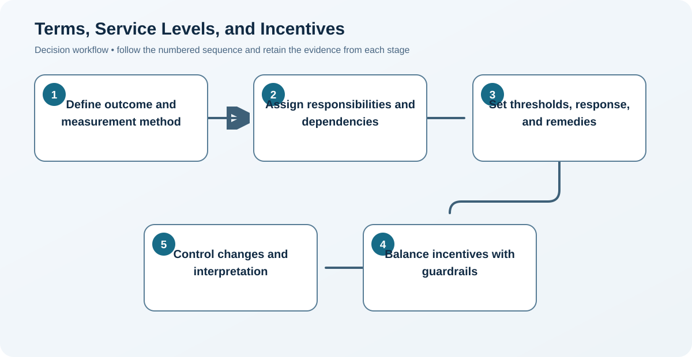

# 7. Terms, Service Levels, and Incentives

## Learning objectives

After this topic, you should be able to:

- translate expectations into measurable obligations;
- design balanced remedies and incentives;
- establish change and dispute controls;

## Concept in plain English

Terms define price, scope, delivery, quality, ownership, data, confidentiality, security, reporting, change, liability, continuity, audit, dispute, and exit. Service levels add measurable performance targets, responsibilities, data rules, and response paths.

## Why it matters

Ambiguous terms create different operating assumptions. Poor incentives optimize one measure while damaging another.

## Decision workflow

### Evidence retained at each stage

| Stage | Required evidence or output |
|---|---|
| **1. Define outcome and measurement method** | Outcome definition with formula, source data, clock, exclusions, tolerance, and approval |
| **2. Assign responsibilities and dependencies** | Responsibility matrix for supplier, buyer, carrier, system, and other dependencies |
| **3. Set thresholds, response, and remedies** | Target, threshold, severity, notification, containment, recovery, remedy, and escalation |
| **4. Balance incentives with guardrails** | Balanced incentive design protected by quality, safety, documentation, and behavior guardrails |
| **5. Control changes and interpretation** | Change, interpretation, dispute, waiver, version, communication, and approval process |

## Realistic example — Rivermark Climate Systems

Rivermark defines delivery as receipt within a two-day window, measured against the last mutually accepted schedule. A capacity incentive applies only when delivery, defect, and documentation thresholds are all met.

**Decision insight.** Linking the capacity reward to delivery, quality, and documentation prevents the supplier from earning the incentive by optimizing only output volume.

All names and values in this example are fictional and independently selected for learning purposes.

## Decision logic

- Specify source data, time zone, exclusions, and approval rules.
- Use service credits or incentives proportionate to consequence.
- Require legal review; educational examples are not contract language.

## Trade-offs

| Choice tension | Decision implication |
|---|---|
| Detailed terms reduce ambiguity but can become hard to operate | Turn only decision-relevant obligations into operational measures; keep definitions readable enough for daily users to apply consistently. |
| Penalties deter failure but may encourage concealment or risk premiums | Use proportionate remedies alongside early-warning and recovery incentives so parties do not hide problems or price in excessive downside. |

## Commonly confused with

A KPI observes performance. A service level is a committed threshold with responsibilities and consequences.

## Common mistakes

- Using 'on time' without a date and window definition.
- Rewarding volume while ignoring quality.
- Omitting exit assistance and data return.

## Original knowledge check

**Question.** What makes a service level operational?

A. A positive relationship

B. A measurable definition, data source, owner, frequency, and response

C. A broad promise to perform well

D. A long contract term

Answer and rationale

### Correct answer

**B. A measurable definition, data source, owner, frequency, and response**

### Why it is correct

The parties need reproducible evidence and a predetermined response.

### Why the other answers are wrong

A, C, and D do not create an executable measure.

## Practitioner perspective

Run each clause through a tabletop scenario: normal operation, failure, change, dispute, and termination.

## Related concepts

- [Module 3 overview](../README.md)
- [Section D overview](./README.md)
- [Sourcing and procurement formula sheet](../../calculations/sourcing-procurement/formula-sheet.md)

---

[Previous: Contract Types and Risk Allocation](./06-contract-types-and-risk-allocation.md) · [Next: Payment, Trade Finance, and Currency Exposure](./08-payment-trade-finance-and-currency.md)
