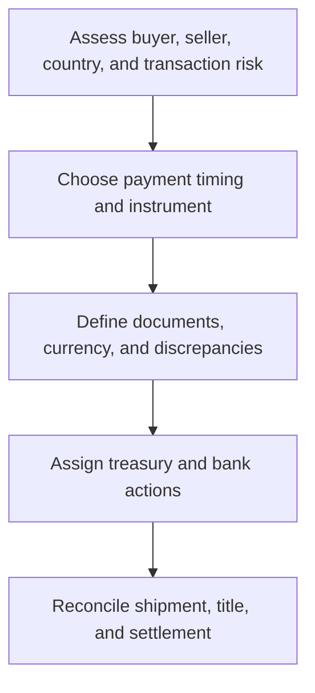

# 8. Payment, Trade Finance, and Currency Exposure

## Learning objectives

After this topic, you should be able to:

- compare payment-risk positions;
- explain documentary trade finance at a high level;
- identify currency exposure and controls;

## Concept in plain English

Payment terms allocate timing and counterparty risk. Documentary instruments can add bank-backed controls to international trade. Foreign-currency commitments create exposure when exchange rates change between pricing, ordering, receipt, and settlement.

## Why it matters

A favorable item price can be offset by financing cost, documentation failure, delayed cash, bank fees, or currency movement.

## How it works

1. **Assess buyer, seller, country, and transaction risk.** Confirm the decision boundary, inputs, and accountable owner before analysis begins.
2. **Choose payment timing and instrument.** Use comparable evidence and keep assumptions visible as the decision develops.
3. **Define documents, currency, and discrepancies.** Use comparable evidence and keep assumptions visible as the decision develops.
4. **Assign treasury and bank actions.** Use comparable evidence and keep assumptions visible as the decision develops.
5. **Reconcile shipment, title, and settlement.** Record the result, evidence, residual risk, and next review trigger.

## Realistic example — Rivermark Climate Systems

Rivermark buys tooling in euros while reporting in U.S. dollars. Finance records the exposure at contract approval, compares natural offsets and hedging options, and defines who absorbs bank and document-discrepancy fees.

All names and values in this example are fictional and independently selected for learning purposes.

## Decision logic

- Match payment security to relationship and country risk.
- Calculate the annualized cost of early-payment discounts.
- Use treasury and legal specialists for currency and trade-finance decisions.

## Trade-offs

| Choice tension | Decision implication |
|---|---|
| More secure instruments reduce counterparty risk but add cost and documentation | Quantify the benefit and the exposure using the same scope and horizon. |
| Longer terms improve buyer cash but can weaken supplier health | Set a guardrail, owner, and review trigger instead of assuming one permanent answer. |

## Commonly confused with

A letter of credit manages documentary payment risk; it does not prove that goods will perform technically.

## Common mistakes

- Leaving currency unspecified.
- Treating a hedge as a profit strategy.
- Failing to align contract, shipping, and bank documents.

## Original knowledge check

**Question.** What does a documentary letter of credit primarily reduce?

A. Product-design risk

B. Counterparty payment risk when compliant documents are presented

C. Supplier process variation

D. Forecast error

Answer and rationale

### Correct answer

**B. Counterparty payment risk when compliant documents are presented**

### Why it is correct

The banking arrangement conditions payment on specified documentary compliance.

### Why the other answers are wrong

A, C, and D require other technical and planning controls.

## Practitioner perspective

Map the physical, document, title, and cash flows separately; they move on different timelines.

## Related concepts

- [Module 3 overview](../README.md)
- [Section D overview](./README.md)
- [Sourcing and procurement formula sheet](../../calculations/sourcing-procurement/formula-sheet.md)

---

[Previous: Terms, Service Levels, and Incentives](./07-terms-slas-and-incentives.md) · [Next: Purchase Orders and Blanket Arrangements](./09-purchase-orders-and-blanket-orders.md)
