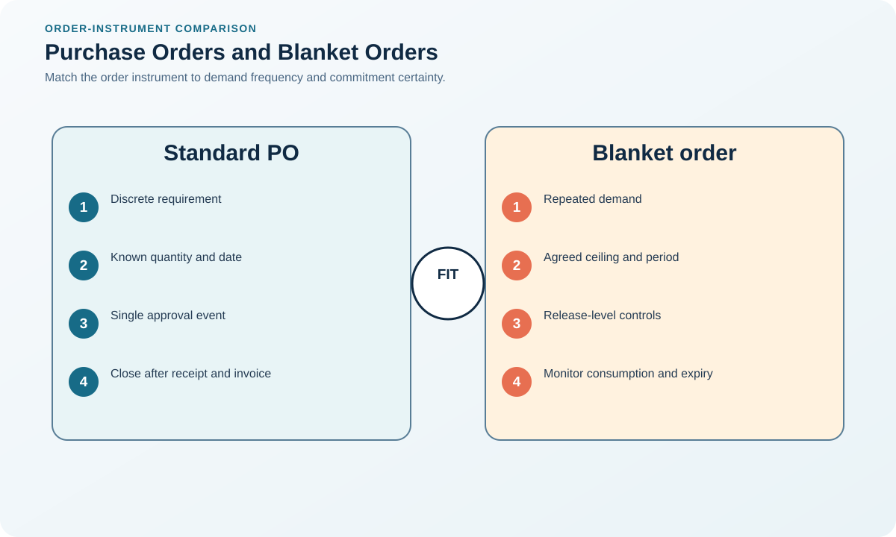

# 9. Purchase Orders and Blanket Arrangements

## Learning objectives

After this topic, you should be able to:

- understand purchase-order control;
- choose between discrete and blanket structures;
- manage releases against commitments;

## Concept in plain English

A purchase order authorizes a defined purchase and communicates item, quantity, price, timing, delivery, and applicable terms. A blanket arrangement establishes recurring commercial conditions while individual releases call off specific requirements.

## Why it matters

Blanket structures reduce repeated transaction effort but create risks when forecasts, minimums, pricing, expiry, and release authority are unclear.

## Decision workflow

### Evidence retained at each stage

| Stage | Required evidence or output |
|---|---|
| **1. Approve the requisition and source** | Approved requisition, source, price, budget, accounting, specification, quantity, date, and delivery point |
| **2. Create and transmit the order or release** | Clear order or release transmitted through an agreed channel with version control |
| **3. Obtain supplier acknowledgement** | Supplier acknowledgement of quantity, date, price, revision, location, and exceptions |
| **4. Control changes and commitments** | Authorized change record covering commercial, schedule, design, and quantity effects |
| **5. Close after receipt, acceptance, and settlement** | Closure after receipt, acceptance, invoice resolution, commitment release, and record retention |

## Realistic example — Rivermark Climate Systems

Rivermark uses a twelve-month blanket arrangement for common filters with monthly releases. It sets forecast ranges, no automatic volume guarantee beyond firm releases, price breaks, lead time, and an exit path for repeated failure.

**Decision insight.** The blanket arrangement reduces transaction effort without silently converting forecasts into guaranteed volume or allowing uncontrolled releases.

All names and values in this example are fictional and independently selected for learning purposes.

## Decision logic

- Use discrete orders for one-time or irregular needs.
- Use blanket structures for repeatable demand under stable terms.
- Track total releases, remaining commitment, expiry, and supplier capacity.

## Trade-offs

| Choice tension | Decision implication |
|---|---|
| Blankets lower ordering cost but can create unintended commitments | State that forecasts support planning while only defined releases create commitments; cap value, term, and quantity exposure explicitly. |
| Discrete orders preserve flexibility but repeat administrative work | Use discrete orders for irregular or uncertain demand and automate repeat transactions where stable controls reduce total administrative cost. |

## Commonly confused with

A forecast communicates expected demand; a firm release creates an authorized requirement under the agreement.

## Common mistakes

- Treating an unacknowledged order as operationally confirmed.
- Allowing price or date changes outside change control.
- Releasing beyond approved value or term.

## Original knowledge check

**Question.** What is the primary benefit of a blanket arrangement?

A. It removes the need for receiving

B. It replaces all forecasts with guaranteed volume

C. It avoids renegotiating common terms for each recurring release

D. It eliminates supplier-performance review

Answer and rationale

### Correct answer

**C. It avoids renegotiating common terms for each recurring release**

### Why it is correct

Master terms are established once while releases specify recurring needs.

### Why the other answers are wrong

A and D remain necessary; B confuses forecast and commitment.

## Practitioner perspective

Make firm, planned, and forecast horizons visually distinct in every supplier schedule.

## Related concepts

- [Module 3 overview](../README.md)
- [Section D overview](./README.md)
- [Sourcing and procurement formula sheet](../../calculations/sourcing-procurement/formula-sheet.md)

---

[Previous: Payment, Trade Finance, and Currency Exposure](./08-payment-trade-finance-and-currency.md) · [Next: Receiving and Three-Way Match](./10-receiving-and-three-way-match.md)
