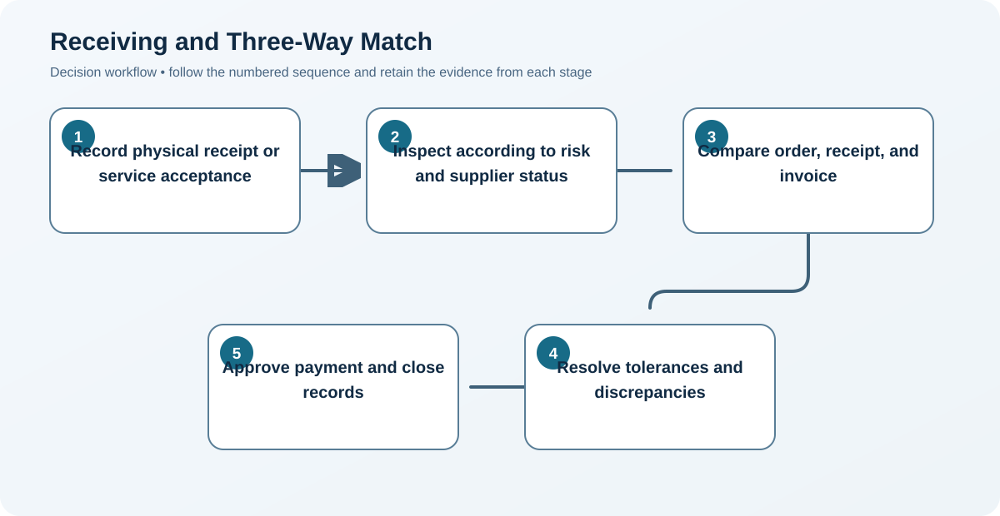

# 10. Receiving and Three-Way Match

## Learning objectives

After this topic, you should be able to:

- trace receipt and invoice control;
- manage quantity, price, and acceptance differences;
- design risk-based inspection;

## Concept in plain English

Three-way match compares the authorized order, evidence of receipt or service acceptance, and supplier invoice before payment. Receiving verifies identity, quantity, condition, and required quality evidence.

## Why it matters

The control prevents unauthorized, duplicate, incorrect, or premature payment while creating reliable inventory and financial records.

## Decision model and workflow

### Evidence retained through the workflow

| Stage | Required evidence or output |
|---|---|
| **1. Record physical receipt or service acceptance** | Timestamped receipt or service acceptance linked to order, shipment, lot, serial, and location |
| **2. Inspect according to risk and supplier status** | Risk-based inspection status, sample, result, nonconformance, disposition, and release authority |
| **3. Compare order, receipt, and invoice** | Comparison of order, accepted receipt, and invoice for item, quantity, price, tax, freight, and terms |
| **4. Resolve tolerances and discrepancies** | Owned discrepancy workflow with tolerances, evidence, debit or credit, and escalation |
| **5. Approve payment and close records** | Payment approval and auditable closure of receipt, quality, invoice, and commitment records |

## Realistic example — Rivermark Climate Systems

Rivermark receives 996 boards against an order for 1,000. Four were damaged in transit. The receipt records 996 accepted, the discrepancy is assigned, and the invoice is blocked until quantity and freight responsibility are resolved.

**Decision insight.** Recording only the 996 accepted boards keeps inventory, supplier performance, liability, and payment aligned while the four damaged units are resolved.

All names and values in this example are fictional and independently selected for learning purposes.

## Decision logic

- Define tolerances by category and risk.
- Separate receipt from technical acceptance when testing takes time.
- Use certified-supplier status only with monitoring and revocation rules.

## Trade-offs

| Choice tension | Decision implication |
|---|---|
| Full inspection reduces escape risk but adds delay and cost | Shift inspection intensity using supplier performance, process capability, item criticality, and change status—not convenience alone. |
| Automatic match improves efficiency but depends on clean master and transaction data | Automate clean matches but route exceptions by cause and value so efficiency does not approve unsupported payment. |

## Commonly confused with

A packing slip is supplier shipment information. A receiving record is the buyer's evidence of what was actually accepted.

## Common mistakes

- Paying from the invoice alone.
- Correcting discrepancies outside the system.
- Reducing inspection without performance evidence.

## Original knowledge check

**Question.** Which documents form the classic three-way match?

A. Forecast, contract, and scorecard

B. Purchase order, receiving record, and invoice

C. Bid, email, and bank statement

D. Bill of material, routing, and forecast

Answer and rationale

### Correct answer

**B. Purchase order, receiving record, and invoice**

### Why it is correct

The match links authorization, receipt, and requested payment.

### Why the other answers are wrong

A, C, and D do not establish all three control points.

## Practitioner perspective

Design exception queues, not only happy paths. The value of matching is in disciplined resolution of differences.

## Related concepts

- [Module 3 overview](../README.md)
- [Section D overview](./README.md)
- [Sourcing and procurement formula sheet](../../calculations/sourcing-procurement/formula-sheet.md)

---

[Previous: Purchase Orders and Blanket Arrangements](./09-purchase-orders-and-blanket-orders.md) · [Next: Order Tracking, Exceptions, and Expediting](./11-order-tracking-exceptions-and-expediting.md)
