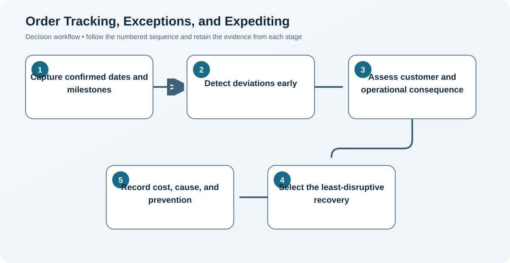
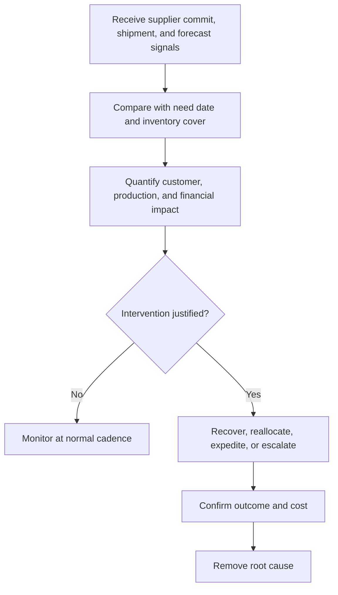

# 11. Order Tracking, Exceptions, and Expediting

## Learning objectives

After this topic, you should be able to:

- create cross-functional open-order visibility;
- prioritize exceptions by consequence;
- use expediting as controlled recovery;

## Concept in plain English

Order tracking maintains shared status from acknowledgement through receipt and closure. Exception management highlights the minority of orders needing action. Expediting is an extraordinary priority change to recover a threatened requirement.

## Why it matters

Uncontrolled expediting raises freight and production cost, disrupts other customers, hides planning problems, and rewards the loudest request.

## Decision model and workflow

### Evidence retained through the workflow

| Stage | Required evidence or output |
|---|---|
| **1. Capture confirmed dates and milestones** | Supplier-confirmed dates, quantities, milestones, logistics events, and change history |
| **2. Detect deviations early** | Exception signal comparing latest commitment with need date, buffer, and confidence |
| **3. Assess customer and operational consequence** | Consequence assessment by customer promise, production, inventory, revenue, safety, and contract |
| **4. Select the least-disruptive recovery** | Recovery options ranked by service protection, feasibility, collateral impact, cost, and authority |
| **5. Record cost, cause, and prevention** | Closed-loop record of decision, premium cost, cause, accountability, and preventive action |

## Practical process flow

## Realistic example — Rivermark Climate Systems

A late compressor threatens two customer units. Rivermark compares reallocating uncommitted inventory, partial shipment, supplier overtime, and air freight. The approved option protects the contractual priority customer and records the recovery cost against the cause.

**Decision insight.** The recovery decision protects the highest contractual consequence while exposing premium cost and root cause instead of normalizing emergency work.

All names and values in this example are fictional and independently selected for learning purposes.

## Applied decision artifact — exception priority board

Use the [open-order exception dataset](../../assets/data/module-3/section-d/open-order-exceptions.csv) to prioritize impact, not lateness alone. The refrigerant sensor is forecast 12 days late with only two days of cover and a final-test stoppage; it requires immediate recovery. The compressor is nine days late with three days of cover and two priority units affected. The filter kit is on time with 26 days of cover and requires no action.

For each intervention, record customer or production consequence, recovery option, incremental cost, authority, owner, supplier commitment, and next check. After stabilization, classify the root cause and prevention owner. Repeated premium freight without corrective action is not exception management.

## Decision logic

- Use formal priority rules and approval authority.
- Do not promise recovery before checking displaced demand.
- Trend expedite frequency, cost, supplier cause, and internal cause.

## Trade-offs

| Choice tension | Decision implication |
|---|---|
| Earlier alerts create more decision time but may include false positives | Tune alerts to remaining decision time and consequence, suppress duplicates, and measure whether alerts lead to action. |
| Buffers reduce expedites but tie up cash | Compare buffer cost with expedite frequency, premium freight, disruption consequence, and obsolescence at the item-segment level. |

## Commonly confused with

Follow-up confirms normal progress. Expediting requests performance faster than the normal or committed path.

## Common mistakes

- Calling every status request an expedite.
- Solving one order without checking the displaced order.
- Failing to correct recurring root causes.

## Original knowledge check

**Question.** What is the best evidence that expediting is systemic rather than exceptional?

A. One urgent customer request

B. Recurring expedite cost and priority changes on the same category

C. A supplier sends weekly updates

D. Inventory is counted monthly

Answer and rationale

### Correct answer

**B. Recurring expedite cost and priority changes on the same category**

### Why it is correct

Repeated extraordinary recovery signals a planning, capacity, lead-time, or supplier-performance problem.

### Why the other answers are wrong

A can be isolated; C and D are routine controls.

## Practitioner perspective

Every expedite should produce two outputs: a recovery decision now and a prevention owner for later.

## Related concepts

- [Module 3 overview](../README.md)
- [Section overview](./README.md)
- [Open-order exception dataset](../../assets/data/module-3/section-d/open-order-exceptions.csv)
- [Terms, Service Levels, and Incentives](./07-terms-slas-and-incentives.md)

---

[Previous: Receiving and Three-Way Match](./10-receiving-and-three-way-match.md) · [Next: Digital Procurement, Marketplaces, and Auctions](./12-digital-procurement-marketplaces-and-auctions.md)
