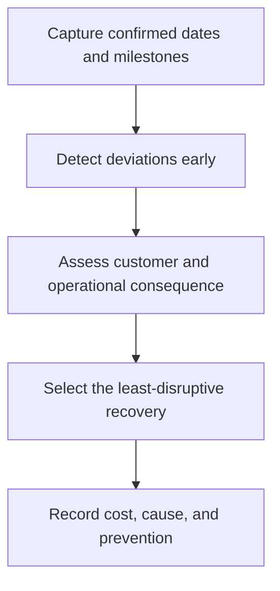

# 11. Order Tracking, Exceptions, and Expediting

## Learning objectives

After this topic, you should be able to:

- create cross-functional open-order visibility;
- prioritize exceptions by consequence;
- use expediting as controlled recovery;

## Concept in plain English

Order tracking maintains shared status from acknowledgement through receipt and closure. Exception management highlights the minority of orders needing action. Expediting is an extraordinary priority change to recover a threatened requirement.

## Why it matters

Uncontrolled expediting raises freight and production cost, disrupts other customers, hides planning problems, and rewards the loudest request.

## How it works

1. **Capture confirmed dates and milestones.** Confirm the decision boundary, inputs, and accountable owner before analysis begins.
2. **Detect deviations early.** Use comparable evidence and keep assumptions visible as the decision develops.
3. **Assess customer and operational consequence.** Use comparable evidence and keep assumptions visible as the decision develops.
4. **Select the least-disruptive recovery.** Use comparable evidence and keep assumptions visible as the decision develops.
5. **Record cost, cause, and prevention.** Record the result, evidence, residual risk, and next review trigger.

## Realistic example — Rivermark Climate Systems

A late compressor threatens two customer units. Rivermark compares reallocating uncommitted inventory, partial shipment, supplier overtime, and air freight. The approved option protects the contractual priority customer and records the recovery cost against the cause.

All names and values in this example are fictional and independently selected for learning purposes.

## Decision logic

- Use formal priority rules and approval authority.
- Do not promise recovery before checking displaced demand.
- Trend expedite frequency, cost, supplier cause, and internal cause.

## Trade-offs

| Choice tension | Decision implication |
|---|---|
| Earlier alerts create more decision time but may include false positives | Quantify the benefit and the exposure using the same scope and horizon. |
| Buffers reduce expedites but tie up cash | Set a guardrail, owner, and review trigger instead of assuming one permanent answer. |

## Commonly confused with

Follow-up confirms normal progress. Expediting requests performance faster than the normal or committed path.

## Common mistakes

- Calling every status request an expedite.
- Solving one order without checking the displaced order.
- Failing to correct recurring root causes.

## Original knowledge check

**Question.** What is the best evidence that expediting is systemic rather than exceptional?

A. One urgent customer request

B. Recurring expedite cost and priority changes on the same category

C. A supplier sends weekly updates

D. Inventory is counted monthly

Answer and rationale

### Correct answer

**B. Recurring expedite cost and priority changes on the same category**

### Why it is correct

Repeated extraordinary recovery signals a planning, capacity, lead-time, or supplier-performance problem.

### Why the other answers are wrong

A can be isolated; C and D are routine controls.

## Practitioner perspective

Every expedite should produce two outputs: a recovery decision now and a prevention owner for later.

## Related concepts

- [Module 3 overview](../README.md)
- [Section D overview](./README.md)
- [Sourcing and procurement formula sheet](../../calculations/sourcing-procurement/formula-sheet.md)

---

[Previous: Receiving and Three-Way Match](./10-receiving-and-three-way-match.md) · [Next: Digital Procurement, Marketplaces, and Auctions](./12-digital-procurement-marketplaces-and-auctions.md)
