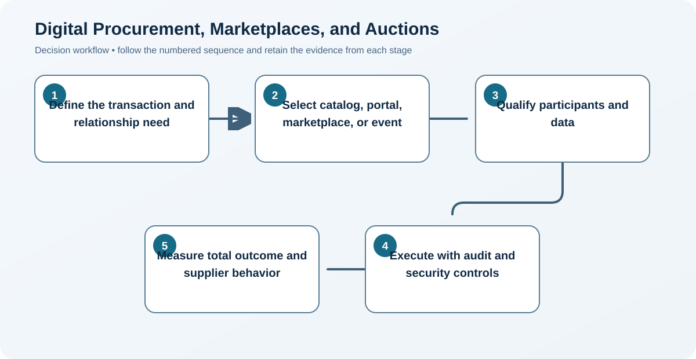

# 12. Digital Procurement, Marketplaces, and Auctions

## Learning objectives

After this topic, you should be able to:

- distinguish portals, marketplaces, and exchanges;
- choose appropriate auction use;
- manage data and relationship risks;

## Concept in plain English

Digital procurement can automate catalogs, approvals, sourcing events, orders, acknowledgements, invoices, and supplier collaboration. Marketplaces connect buyers and sellers; private platforms provide controlled partner interaction; auctions discover price under defined competition.

## Why it matters

Technology reduces search and transaction cost, but it can also amplify poor specifications, fragmented data, security exposure, and price-only behavior.

## Decision model and workflow

### Evidence retained through the workflow

| Stage | Required evidence or output |
|---|---|
| **1. Define the transaction and relationship need** | Transaction profile covering specification, frequency, value, competition, sensitivity, integration, and relationship need |
| **2. Select catalog, portal, marketplace, or event** | Channel decision among catalog, portal, exchange, sourcing event, or direct collaboration |
| **3. Qualify participants and data** | Qualified participants plus clean item, supplier, price, contract, user, and approval data |
| **4. Execute with audit and security controls** | Role-based access, audit trail, bid rules, cybersecurity, segregation, retention, and exception controls |
| **5. Measure total outcome and supplier behavior** | Outcome view covering total cost, cycle time, compliance, quality, participation, and supplier behavior |

## Realistic example — Rivermark Climate Systems

Rivermark uses an approved catalog for routine supplies, a private portal for compressor forecasts and quality records, and a reverse auction only for prequalified, interchangeable packaging materials.

**Decision insight.** Rivermark assigns each channel to a different need, preventing a price-focused auction from damaging strategic collaboration or forcing routine buys through manual negotiation.

All names and values in this example are fictional and independently selected for learning purposes.

## Decision logic

- Use auctions when qualified offers are truly substitutable.
- Protect sensitive demand, design, and pricing data by role.
- Include integration and supplier-participation cost in the business case.

## Trade-offs

| Choice tension | Decision implication |
|---|---|
| Public markets expand reach but provide less relationship control | Use public markets for discoverable, comparable supply; protect strategic or sensitive collaboration through qualified private channels. |
| Private platforms enable collaboration but cost more to operate | Justify private-platform cost through adoption, integration, cycle-time, data-quality, collaboration, and control benefits. |

## Commonly confused with

A portal presents role-based information and transactions. A marketplace or exchange matches multiple trading parties.

## Common mistakes

- Using a reverse auction before qualification.
- Assuming lowest electronic bid equals lowest total cost.
- Forcing small suppliers into costly connections without value.

## Original knowledge check

**Question.** Which purchase is the best reverse-auction candidate?

A. A jointly designed safety-critical compressor

B. A scarce patented sensor

C. Standard cartons from several qualified interchangeable suppliers

D. A complex engineering service

Answer and rationale

### Correct answer

**C. Standard cartons from several qualified interchangeable suppliers**

### Why it is correct

The requirement is comparable, competition is credible, and price can meaningfully differentiate qualified offers.

### Why the other answers are wrong

A, B, and D depend on unique capability, scarcity, or complex value.

## Practitioner perspective

Automate routine friction and preserve human attention for ambiguity, risk, innovation, and relationships.

## Related concepts

- [Module 3 overview](../README.md)
- [Section D overview](./README.md)
- [Sourcing and procurement formula sheet](../../calculations/sourcing-procurement/formula-sheet.md)

---

[Previous: Order Tracking, Exceptions, and Expediting](./11-order-tracking-exceptions-and-expediting.md) · [Section review](./13-section-d-review.md)
