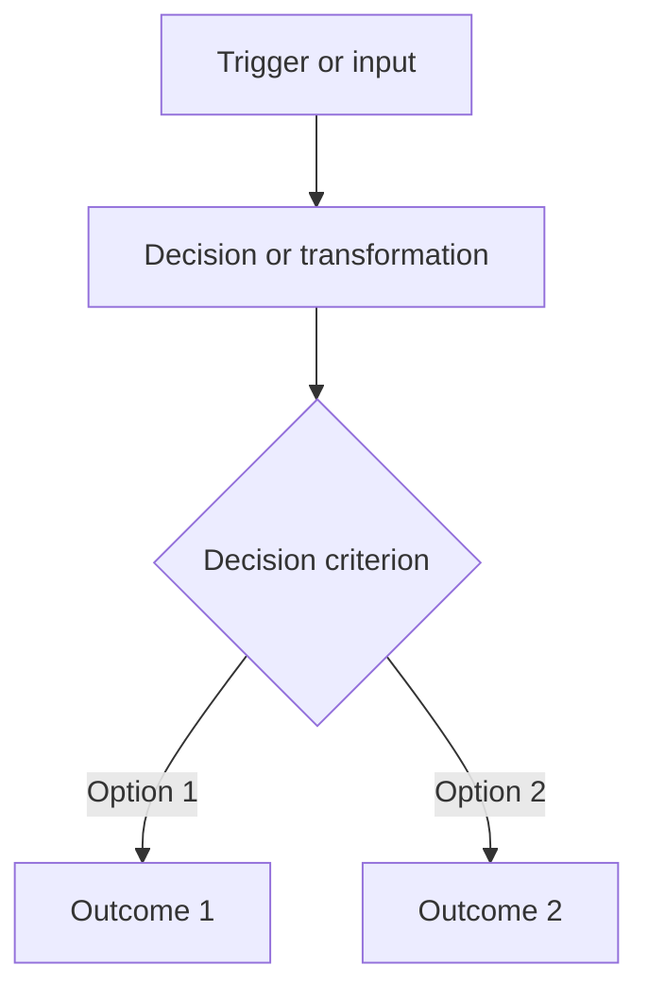

# Visual and Data Asset Guide

This directory contains independently created assets used by the learning notes.

```text
assets/
├── diagrams/module-1/section-x/   Module 1 standalone SVG diagrams
├── diagrams/module-2/section-x/   Module 2 standalone SVG diagrams
├── diagrams/module-3/section-x/   Module 3 render-safe workflow SVG diagrams
├── data/module-1/section-x/       Module 1 section datasets
├── data/module-1/capstone/        Module 1 integrated case data
├── data/module-2/section-x/       Module 2 section and capstone data
└── data/module-3/section-x/       Module 3 section datasets
```

Sections without standalone files use repository-native Mermaid diagrams or Markdown tables within their topic pages.

## Adding a diagram or process flow

1. Decide whether Mermaid, SVG, or a Markdown table communicates the relationship most clearly.
2. Name standalone assets with lower-case kebab case, such as `supplier-risk-response-flow.svg`.
3. Place the asset under `diagrams/module-N/section-x/` and link it with a relative path.
4. Add meaningful alternative text and a short explanation in the learning page.
5. Explain its instructional purpose on the page where it is used.
6. Render the asset at full-page and narrow-page widths; inspect every label for clipping and overlap.
7. Confirm that the design is original and satisfies [`../ATTRIBUTION.md`](../ATTRIBUTION.md).

## Mermaid process-flow placeholder

Copy and replace the labels; do not retain a node that adds no instructional value.



## SVG placeholder requirements

An original SVG should include a descriptive `<title>`, a useful `<desc>`, readable text, a `viewBox`, and no embedded raster image or external script. Use explicit `<tspan>` line breaks when labels must wrap; do not depend on browser-specific `foreignObject` text wrapping. Keep the source editable and avoid copying the composition of a third-party diagram.

## Dataset requirements

- Use fictional entities and non-confidential values.
- Include a header row and consistent columns.
- State units, time periods, assumptions, and whether values are illustrative.
- Link the dataset from the page that explains its learning purpose.
